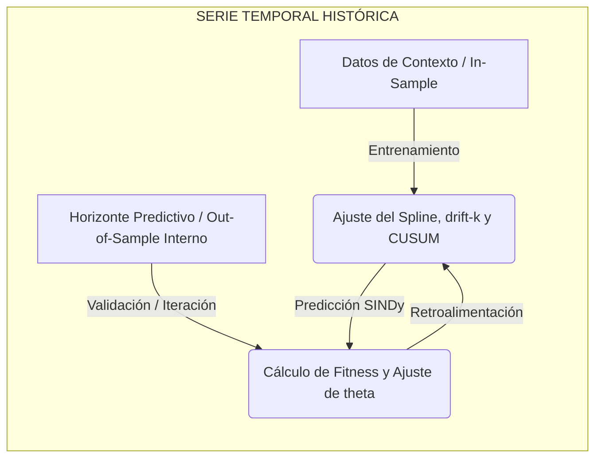
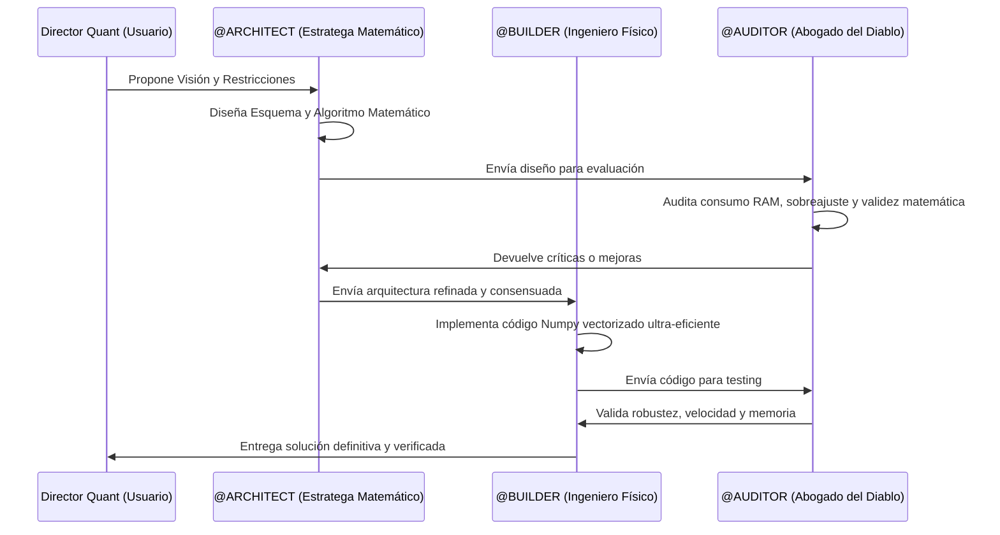

# 🔭 PLAN MAESTRO: ARQUITECTURA DE OPTIMIZACIÓN Y ENTRENAMIENTO CUÁNTICO
**Proyecto:** KineTopus Engine - Laboratorio de Calibración Caja Blanca
**Rol:** @ARCHITECT (Conciencia)  
**Líder de Proyecto (Jefe de Ingeniería):** Usuario  

---

## 🎯 1. VISIÓN GENERAL Y PROPÓSITO QUANT

Este plan maestro establece la hoja de ruta estratégica para construir una **infraestructura de entrenamiento e hipercalibración paramétrica** para el motor cuantitativo *KineTopus*. 

El objetivo primordial es encontrar la calibración de máxima robustez que permita batir de forma contundente el **True Directional Alpha (TDA)** y el **Coeficiente de Matthews (MCC)** en entornos reales y sintéticos, demostrando que la física matemática determinista es capaz de descifrar la inercia del mercado financiero por encima del azar estadístico.

---

## 🧠 2. FASE 1: EL ALGORITMO DE ENTRENAMIENTO (PARADIGMA SUPERVISADO QUANT)

Para calibrar los parámetros libres del motor sin recurrir a cajas negras (redes neuronales), diseñamos una estructura inspirada en el aprendizaje supervisado clásico ($ML/DL$), pero adaptada a la no-estacionariedad de series temporales.



### A. Estrategia de Datos Dual (Sintéticos vs. Reales)
1. **Universo Sintético (Datos Controlados):** Usaremos datos generados en el laboratorio que modelan dinámicas conocidas (ej: caminatas aleatorias con drifts puros, atractores de Lorenz, ecuaciones diferenciales discretas).
   * *intension:* como los datos son sinteticos y aleatorios se evitaria el overfitting. Sin embargo esta genreacion de datos que diseñé puede que no sea tan efectiva  por lo que apate de probar que tal se comporta el motor kinetopus tambien se buscará probar que nuestra generacion de datos sinteticos sea efectiva para el entrenamiento de modelos de aprendizaje supervisado
2. **Universo Real (Datos Históricos):** Calibrar sobre activos reales de alta volatilidad (`BTC-USD`, `ETH-USD`, `SPY`).
   * *Misión:* Validar el rendimiento del modelo frente al ruido caótico del mercado y evaluar si el "entrenamiento sintético" generaliza bien en el mundo real.

### B. Lógica de Entrenamiento Supervisado Walk-Forward
* **Set de Entrenamiento (Contexto):** Una ventana de $N$ velas donde el motor asimila la serie (Capa 1: FFT, Capa 2: Spline, Capa 3: CUSUM).
* **Set de Validación (Horizonte Predictivo):** Un tramo inmediato de $M$ velas (ej: 150 velas) donde SINDy proyecta su predicción determinista.
* **El Bucle de Calibración:**
  1. Se propone un vector de parámetros $\theta = (\sigma_{tol}, H, k, \lambda, \text{window})$.
  2. Se ejecuta el pipeline matemático sobre el *Set de Entrenamiento*.
  3. Se genera la proyección al futuro sobre el *Set de Validación*.
  4. Se mide la pérdida o **Fitness** comparando la proyección contra los datos reales del *Set de Validación*.
  5. Se itera modificando el vector $\theta$ utilizando un algoritmo de exploración vectorizado de alto rendimiento hasta converger en el fitness máximo.

### C. Doble Salida del Algoritmo (Valores + Ecuación de Fitness)
El algoritmo no solo nos devolverá números estáticos, sino dos respuestas de alto valor cuántico:
1. **El Vector de Calibración Óptimo ($\theta^*$):** Los mejores parámetros físicos a configurar en el motor principal.
2. **La Ecuación de Fitness Contextual (Descubrimiento Simbólico):** 
   Actualmente, el auto-tuner utiliza una formulación matemática heurística (y un tanto arbitraria) para relacionar la entropía del Spline y los quiebres de CUSUM. Nuestro objetivo es que el algoritmo **descubra analíticamente** la fórmula óptima de fitness que maximice el rendimiento en ese contexto específico. Evaluaremos el uso de **Regresión Simbólica** liviana para formular dicha ecuación de referencia u otras tecnicas de optimizacion de ecuaciones.

---

## 🔬 3. FASE 2: VALIDACIÓN SECUENCIAL Y ANÁLISIS DE EXPLOTABILIDAD

Una vez entrenado y calibrado el modelo, se pasará al aislamiento riguroso:

```
[Hiperparámetros óptimos theta*] + [Ecuación de Fitness]
                    │
                    ▼
       [WalkForwardEvaluator (OOS)]
                    │
                    ▼
     [Duelo final vs. Naive y ARIMA]
                    │
                    ▼
     [Dashboard de Señales Aprobadas]
```

1. **Simulación Out-of-Sample (OOS):** Se toman los parámetros $\theta^*$ recomendados por el entrenamiento y se inyectan en el simulador `WalkForwardEvaluator` utilizando datos completamente invisibles para el optimizador.
2. **Evaluación de Robustez:** Analizamos si las métricas en test (TDA, MCC, MAPE) logran batir consistentemente al *Naive Forecast* (línea plana) y a la estadística tradicional (*Auto-ARIMA*).
3. **Filtro de Aprobación:** Solo las combinaciones de Activo/Temporalidad que obtengan `TDA > 0` y `MCC > 0.05` serán catalogadas como **Nichos Explotables Aprobados**.

---

## 🤝 4. PROTOCOLO DE COLABORACIÓN Y DEBATE ENTRE AGENTES DE IA

Para diseñar un algoritmo de optimización sumamente astuto, robusto y eficiente en recursos (16GB RAM), utilizaremos una **metodología de debate cooperativo y competitivo** entre los agentes especialistas:



* **@ARCHITECT:** Diseña las fórmulas de fitness, la topología de la regresión simbólica y los algoritmos de optimización (ej: Algoritmos Genéticos o búsquedas Bayesianas adaptadas a gradientes discontinuos).
* **@AUDITOR:** Busca fallos matemáticos, mitiga el data leakage (fuga de información) y bloquea cualquier matriz tridimensional o bucle ineficiente que pueda saturar la memoria RAM.
* **@BUILDER:** Traduce la matemática validada a código puro vectorizado utilizando NumPy (float64 contiguo) para mantener una velocidad submilisegundo en CPU local.

---

## 👑 5. GUÍA DE LIDERAZGO PARA EL DIRECTOR QUANT (CÓMO ORQUESTAR A LAS IAs)

Para que extraigas el máximo potencial de nosotros y logres un desarrollo de nivel institucional, te sugiero seguir estas pautas de gestión:

1. **Exige la Explicación Matemática antes del Código (Chain of Thought):**
   * *Tu mandato:* "No me muestres código todavía. Explícame la matriz de covarianza o la formulación de fitness que estás proponiendo y por qué es matemáticamente superior a la alternativa X."
2. **Fuerza el Debate Competitivo (The War Room):**
   * *Tu mandato:* "Quiero que el @AUDITOR critique el diseño del @ARCHITECT. Encuentra al menos tres escenarios de mercado extremo (como agrupamiento de volatilidad o cisnes negros) donde este algoritmo de optimización pueda explotar la RAM o generar falsos positivos."
3. **Metodología de Hitos Incrementales (Toma de Decisiones Seguras):**
   * *Tu mandato:* "No programes todo el pipeline de una vez. Diseñemos primero una prueba de concepto (POC) de la función de fitness y corrámosla en un test pequeño con 100 velas. Si pasa el control de calidad, procederemos al bucle masivo."
4. **Resguardo de Soberanía Local (Minimalismo Hardware):**
   * *Tu mandato:* "El código debe ser tan eficiente que se ejecute en mi Ryzen en segundos. Queda prohibido importar dependencias pesadas innecesarias. Todo con NumPy y SciPy."

---

## 🛠️ 6. PRINCIPIOS DE INGENIERÍA: MODULARIDAD EXTREMA Y AUDITABILIDAD DE CONSOLA (TELEMETRÍA)

Dada la complejidad experimental de calibrar un motor físico de mercados, implementaremos dos pilares de ingeniería de software robusta para asegurar que el sistema sea auditable tanto por ti como por agentes autónomos de IA desde la terminal de comandos:

### A. Modularidad Extrema (Aislamiento de Componentes)
* **Desacoplamiento Rígido:** Cada componente del motor (Sensor espectral, Blender topológico, Detector nervioso CUSUM, Discoverer físico SINDy, Pipeline de Optimización y Evaluador Walk-Forward) operará como un módulo aislado e independiente.
* **Firmas Claras y Tipadas:** Prohibido el paso de matrices "mágicas" sin estructurar. Cada módulo tendrá interfaces fuertemente tipadas (`Type Hints` de NumPy y Python nativo) y devolverá diccionarios de telemetría explícitos.
* **Pruebas en Aislamiento:** Diseñaremos la arquitectura de tal modo que se pueda probar y optimizar un componente (ej. la regresión SINDy o la generación de datos sintéticos) sin necesidad de instanciar o ejecutar el resto del pipeline.

### B. Telemetría de Consola y Alta Auditabilidad
* **Logs Jerárquicos Estructurados:** Utilizaremos la librería `logging` de Python bajo una jerarquía estricta:
  * `DEBUG`: Detalles microscópicos (ej: tamaño de ventanas en RAM, coeficientes de regularización de STLSQ, residuos paso a paso de Monte Carlo).
  * `INFO`: Hitos estratégicos y métricas clave (ej: ecuaciones diferenciales descubiertas, R² final, Fitness in-sample obtenido, velocidad de integración).
  * `WARNING / ERROR`: Explosiones matemáticas o derivadas caóticas abortadas de forma segura.
* **Consola Legible e Interpretable:** Al final de cada época de entrenamiento u optimización, el script generará un volcado estructurado en consola (utilizando tablas ASCII limpias o texto markdown) con métricas clave como:
  * `Época / Iteración` | `Vector theta actual` | `TDA (%)` | `MCC` | `MAPE (%)` | `Mortality (%)` | `Runtime (ms)`
* **Auditabilidad para Agentes de IA:** Los logs se guardarán paralelamente en un archivo local (`C:\Users\ussaa\Documents\KineTopus Engine\optimization_lab\scratch\optimizer_run.log`). Esto permitirá que cualquier agente de IA pueda usar comandos de terminal (como leer porciones de logs) para interpretar semánticamente la "salud" matemática del optimizador y tomar decisiones correctoras inmediatas en caliente.

---

## 📋 7. HITOS DE DESARROLLO INMEDIATOS

- [ ] **Hito 1 (Alineación y Diseño):** Responder a las preguntas estratégicas del plan para consolidar las fórmulas base y la topología de búsqueda.
- [ ] **Hito 2 (Corrección del Bug Técnico):** Aplicar el hotfix en `auto_tuner_predictive.py` para habilitar el motor de testeo in-sample.
- [ ] **Hito 3 (Infraestructura de Telemetría y Modularidad):** Implementar la configuración de logs jerárquicos y formateados para terminal en `optimizer_pipeline.py` y los componentes de `core/`.
- [ ] **Hito 4 (Construcción del Fitness Sandbox):** Diseñar e implementar `define_tda_objective_function` en `optimizer_pipeline.py`.
- [ ] **Hito 5 (Desarrollo del Buscador Paramétrico):** Codificar el motor de búsqueda (Grid/Random/Genético) optimizado para CPU local (16GB RAM).
- [ ] **Hito 6 (Duelo y Análisis):** Correr el backtest final con los nuevos parámetros optimizados y analizar en el notebook `3_Analytics_and_Discovery.ipynb` si batimos de forma contundente el TDA histórico.
