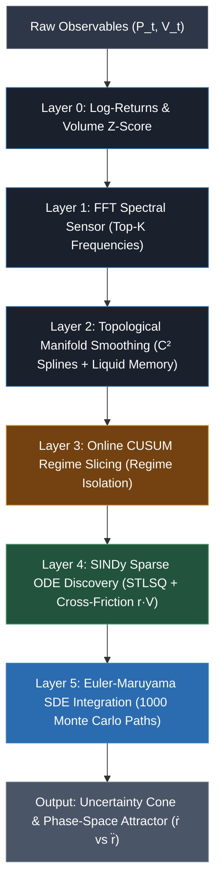
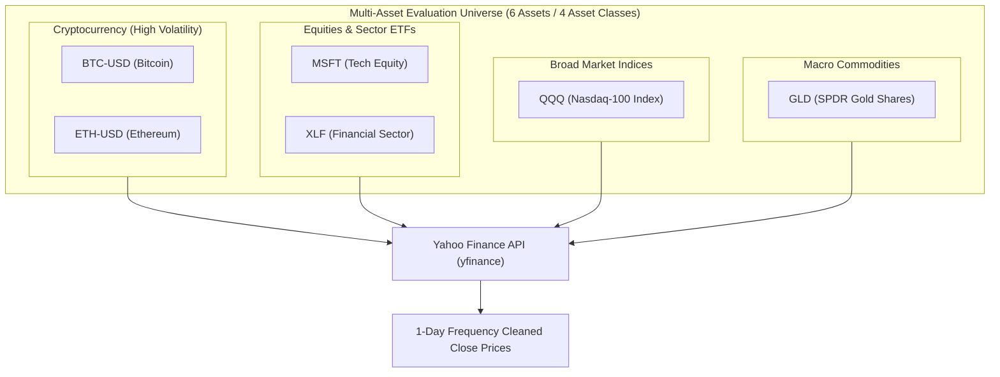
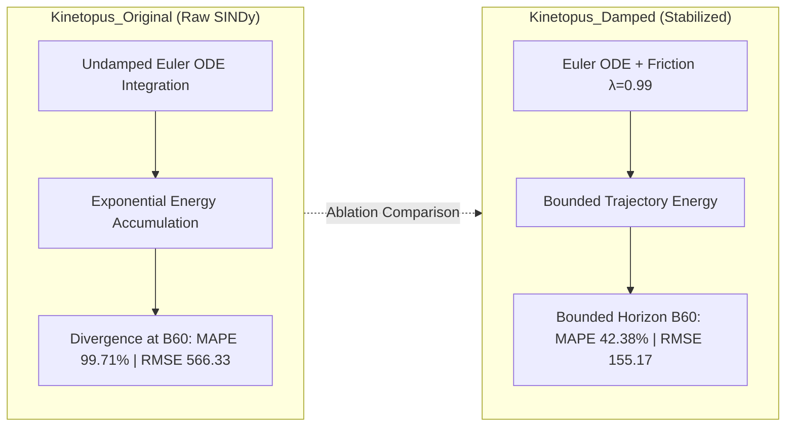
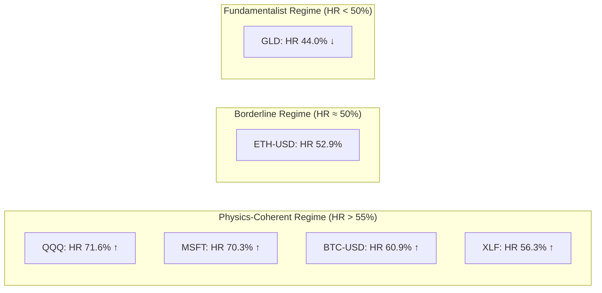
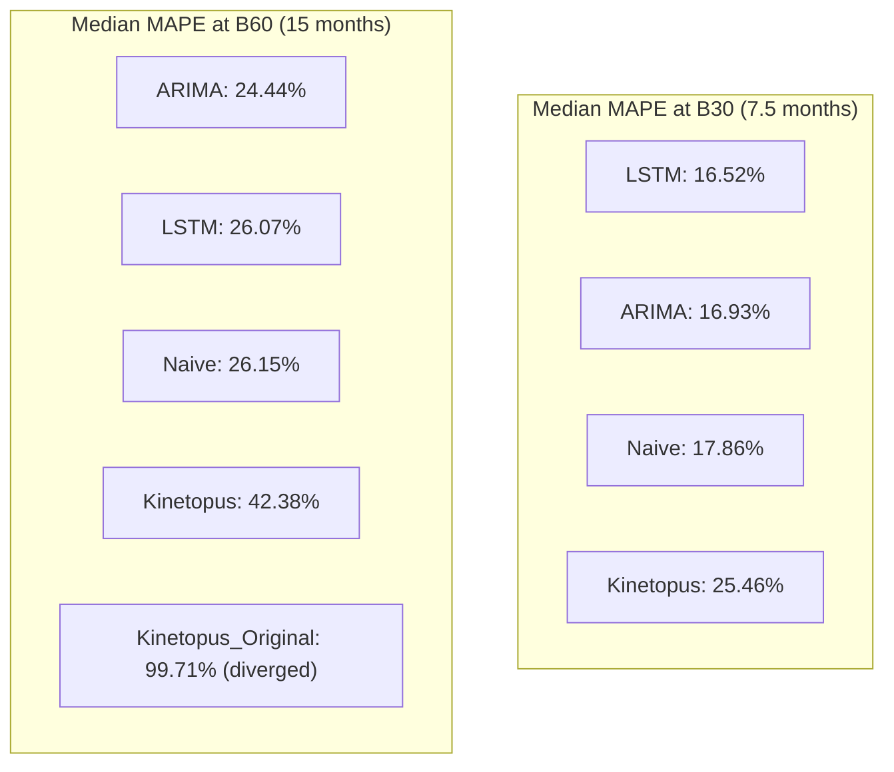
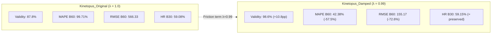
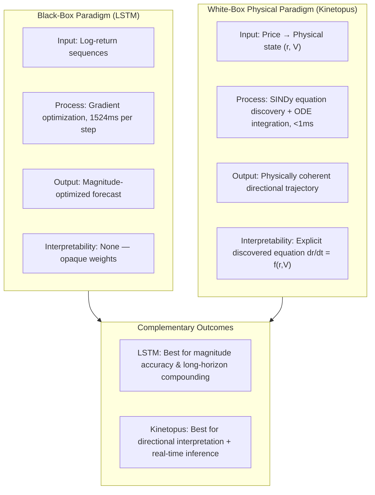
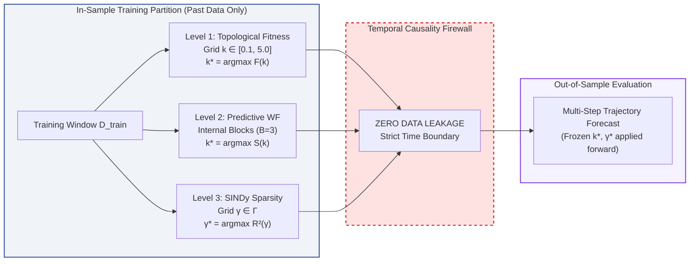

# Kinetopus Engine: A Parsimonious Physical-Mathematical Pipeline for Local-First Financial Time Series Forecasting using Sparse Identification of Dynamical Systems (SINDy)

**Author:** Juan Diego Ussa Aponte  
**Email:** ussaapontejuandiego@gmail.com  
**GitHub Repository:** [https://github.com/JuanDie778/KineTopus-Engine](https://github.com/JuanDie778/KineTopus-Engine)  
**Interactive Application:** [https://huggingface.co/spaces/Juan778/KineTopus_Engine](https://huggingface.co/spaces/Juan778/KineTopus_Engine)  
**Date:** August 2026  

---

## Abstract

Financial time series analysis has long been trapped in a dichotomy between linear, oversimplified statistical models (e.g., ARIMA) and opaque, computationally expensive deep learning black boxes (e.g., LSTMs, Transformers). This paper introduces **Kinetopus Engine**, a parsimonious, White-Box Scientific Machine Learning (SciML) framework that challenges the assumption of pure stochastic randomness by constructing a mathematically justified continuous physical perspective over discrete financial data.

Operating under low computational complexity on consumer-grade CPU hardware, the pipeline integrates five core stages:
1. Spectral sensing via Fast Fourier Transform (FFT) to detect dominant cyclical frequencies.
2. Topological manifold smoothing via $C^2$ Splines to reconstruct continuous price-volume trajectories.
3. Online Cumulative Sum (CUSUM) control mechanisms for real-time structural regime-shift slicing.
4. Sparse Identification of Nonlinear Dynamics (SINDy) to discover explicit, parsimonious ordinary differential equations $\mathrm{d}r/\mathrm{d}t = f(r, V)$.
5. Probabilistic Monte Carlo trajectory projection via Euler-Maruyama stochastic differential equations (SDEs) stabilized by a hydrodynamic friction damping factor ($\lambda = 0.99$).

Empirical evaluation through an extensive walk-forward benchmark encompassing 3,525 evaluation iterations across a heterogeneous six-asset universe (`BTC-USD`, `ETH-USD`, `MSFT`, `QQQ`, `XLF`, `GLD`) demonstrates a sustained aggregate directional Hit Ratio of **59.15%** at a 150-candle horizon (~7.5 months), achieving strong statistical significance against a random-walk null hypothesis ($z = 4.942, p < 0.0001$) and peaking at **71.57%** on broad-market index equities (`QQQ`) and **70.30%** on technology equities (`MSFT`). Furthermore, the physical engine operates at sub-millisecond CPU latency (<1 ms per episode, ~1,525× faster than an LSTM baseline) with a **98.60%** mathematical validity rate, delivering full phase-space interpretability and generating explicit, inspectable governing equations. A complete, interactive deployment is made openly accessible on Hugging Face Spaces.

---

# 1. Introduction

Financial time series forecasting remains one of the most challenging problems in applied mathematics, quantitative finance, and signal processing. Traditionally, asset price dynamics have been modeled under the paradigm of the Efficient Market Hypothesis (EMH) and continuous-time Brownian motion \cite{malkiel1970efficient}, treating short-term price fluctuations as unforecastable stochastic noise. Classical econometric models—such as AutoRegressive Integrated Moving Average (ARIMA) and Generalized Autoregressive Conditional Heteroskedasticity (GARCH)—rely heavily on linear stationarity assumptions. Consequently, their predictive distributions rapidly collapse toward the unconditional historical mean after a few time steps ($3-5$ steps), discarding non-linear directional momentum \cite{box1970time}.

In recent years, the quantitative finance community has pivoted toward non-parametric Machine Learning (ML) and Deep Learning (DL) architectures, including Long Short-Term Memory (LSTM) networks \cite{hochreiter1997long, fischer2018deep}, Temporal Convolutional Networks (TCNs), Transformer-based models \cite{vaswani2017attention, zhou2021informer}, and Physics-Informed Neural Networks (PINNs) \cite{raissi2019physics}. Although these high-capacity black-box approaches excel at fitting complex historical correlations, they present major operational and theoretical bottlenecks:
1. **High Computational Complexity:** Deep neural network architectures require intensive GPU infrastructure, raising the cost per forecast and complicating lightweight deployment.
2. **Opacity and Lack of Interpretability:** Deep learning models function as opaque function approximators, outputting point predictions without revealing the underlying physical laws or differential equations driving system inertia.
3. **Susceptibility to Structural Regime Shifts:** Out-of-sample generalization deteriorates significantly when market dynamics undergo abrupt structural shifts, leading to catastrophic overfitting and unseen model drift.

### 1.1 Motivation: Justifying a Continuous Physical Perspective

At first glance, financial market data appear inherently discrete, noisy, and stochastic. However, when observed through an appropriate continuous lens, price-volume dynamics often display localized geometric trajectories—resembling damped harmonic oscillations, phase-space attractors, and exponential decay regimes. 

While multiple analytical perspectives exist, a fundamental research question arises: **Can a localized continuous physical perspective be mathematically justified and empirically validated over discrete financial series?**

To answer this question, we introduce the **Kinetopus Engine**, a parsimonious Scientific Machine Learning (SciML) framework designed to discover governing equations from noisy time series under low computational complexity. Rather than fitting empirical parameters to discrete, fragmented price bars, Kinetopus lifts discrete time series $X_t \in \mathbb{R}^d$ into a continuous, $C^2$-differentiable topological manifold $X(t)$. By evaluating analytical derivatives $\dot{X}(t)$, the system leverages Sparse Identification of Nonlinear Dynamics (SINDy) \cite{brunton2016discovering, champion2019data} to extract explicit Ordinary Differential Equations (ODEs) governing local dynamic momentum.

### 1.2 White-Box Stochastic Differential Equation (SDE) Formulation

We formalize local price evolution through a generalized Stochastic Differential Equation (SDE) defined over log-returns:

$$ \mathrm{d}r_t = f_{\text{SINDy}}(r_t, V_t) \, \mathrm{d}t + \sigma_{\text{res}} \, \mathrm{d}W_t $$

where $r_t = \ln(P_t / P_{t-1})$ denotes the log-return at discrete time $t$, $V_t$ represents $Z$-score normalized transactional volume acting as an external forcing parameter, $f_{\text{SINDy}}$ is the parsimonious nonlinear dynamic function (drift term) identified via sparse regression over a polynomial library $\Theta(r, V)$—capturing crucial cross-friction interaction terms such as $r_t \cdot V_t$—$\sigma_{\text{res}}$ measures local residual volatility, and $W_t$ represents a standard Wiener process \cite{kloeden1992numerical}.

To prevent historical contamination across structural market breaks, Kinetopus employs online Cumulative Sum (CUSUM) regime slicing \cite{page1954continuous}. The pipeline does not fit a single global equation across the entire time series; instead, CUSUM partitions historical momentum into distinct, stationary regimes, identifying localized SINDy differential equations for each segment and projecting forward *only the active regime*. Furthermore, residual errors are subjected to Ljung-Box hypothesis testing \cite{ljung1978measure} to verify that $f_{\text{SINDy}}$ exhausts all deterministic signals, collapsing non-modeled dynamics into uncorrelated Gaussian white noise.

### 1.3 Key Contributions

The main contributions of this work are summarized as follows:

* **A Unified Continuous-to-Physical SciML Pipeline:** We propose a 5-layer computational framework integrating Fast Fourier Transform (FFT) spectral sensing, $C^2$ Spline topological manifold smoothing, CUSUM-guided regime slicing, SINDy sparse ODE discovery, and Monte Carlo Euler-Maruyama SDE integration.
* **Empirical Multi-Asset Validation (3,525 Iterations):** Through rigorous walk-forward expanding-window evaluation across a heterogeneous 6-asset universe spanning cryptocurrencies (`BTC-USD`, `ETH-USD`), equities (`MSFT`), broad-market indices (`QQQ`), financial sector ETFs (`XLF`), and commodities (`GLD`), we demonstrate a statistically significant aggregate directional Hit Ratio of **59.15% at 150 daily candles** ($z = 4.942, p < 0.0001$), peaking at **71.57% on QQQ** and **70.30% on MSFT**.
* **Hydrodynamic Trajectory Stabilization:** We introduce a physically motivated hydrodynamic friction decay parameter ($\lambda = 0.99$) into forward ODE integration, resolving unbounded energy accumulation over long horizons. In controlled ablation, this term improves mathematical validity from **87.83% to 98.60%** and reduces long-horizon (300-candle) median MAPE by **57.5%** (from 99.71% to 42.38%) while preserving 100% of the mid-horizon directional accuracy.
* **Sub-Millisecond Computational Efficiency:** We show that explicit nonlinear equations can be discovered and integrated on consumer-grade CPU hardware in **<1 ms per episode**—approximately **1,525× faster than deep neural network baselines** (LSTM at 1,524.72 ms)—eliminating DataFrame and GPU overhead in execution hot loops.
* **Phase-Space Telemetry & Open Interactive Deployment:** We introduce an interactive Phase-Space Attractor topology ($\dot{r}_t$ vs. $\ddot{r}_t$) and real-time physical telemetry dashboard. We deploy the complete, functional implementation openly on Hugging Face Spaces (`https://huggingface.co/spaces/Juan778/KineTopus_Engine`) to ensure full academic transparency and reproducible experimentation.

---

# 2. Related Work and SOTA Comparison

Time series forecasting across financial and complex dynamical systems has generated a vast body of literature spanning classical econometrics, non-parametric machine learning, deep neural networks, and recent Scientific Machine Learning (SciML) paradigms. This section categorizes the state of the art (SOTA) into four primary methodological paradigms, details their theoretical and computational trade-offs, and presents a comprehensive comparative matrix establishing the positioning of the **Kinetopus Engine**.

---

## 2.1 Classical Econometric and Linear Autoregressive Models

The foundational literature in quantitative finance relies heavily on linear statistical paradigms. The seminal work of Box and Jenkins \cite{box1970time} formalized AutoRegressive Integrated Moving Average (ARIMA) models, while Bollerslev \cite{bollerslev1986generalized} introduced Generalized Autoregressive Conditional Heteroskedasticity (GARCH) to capture time-varying volatility clustering.

While these models offer exact mathematical tractability and low computational overhead, they suffer from fundamental limitations when applied to non-stationary financial data:
1. **Linear Stationarity Assumption:** ARIMA models assume linear combinations of past values and white-noise residuals, failing to capture non-linear dynamic momentum or cross-variable interactions (e.g., volume-return friction).
2. **Horizon Decay:** Because continuous deterministic drift is absent, multi-step predictions rapidly decay toward the unconditional historical mean after a small number of steps ($3-5$ candles), discarding directional momentum.

---

## 2.2 Sequential Deep Learning and Attention-Based Transformers

To capture non-linear relationships, the quantitative finance community pivoted toward deep recurrent and attention-based architectures. Hochreiter and Schmidhuber \cite{hochreiter1997long} pioneered Long Short-Term Memory (LSTM) networks to address vanishing gradients in sequential sequences. More recently, Transformer architectures \cite{vaswani2017attention} and long-sequence specialists such as Informer \cite{zhou2021informer} have been deployed for multi-horizon series forecasting.

Despite achieving strong empirical curve-fitting on benchmark datasets, these architectures introduce major operational bottlenecks:
1. **Black-Box Opacity:** Deep neural networks map input vectors through millions of uninterpretable weight matrices. They output point forecasts without exposing the underlying physical laws or differential equations governing market momentum.
2. **Computational Overhead:** Training and deploying multi-layer Transformers requires cloud-scale GPU clusters, conflicting with low-latency execution and local data sovereignty ($\le 16\,\text{GB}$ RAM, CPU-only).
3. **Catastrophic Model Drift:** When underlying market regimes undergo structural breaks (e.g., policy shifts or macro shocks), neural networks suffer from catastrophic forgetting and out-of-sample performance degradation unless fully re-trained.

---

## 2.3 Scientific Machine Learning (SciML) and Continuous Dynamical Discovery

Scientific Machine Learning (SciML) bridges data-driven modeling and physical conservation laws. Raissi et al. \cite{raissi2019physics} introduced Physics-Informed Neural Networks (PINNs), embedding partial differential equations (PDEs) into neural loss functions. Chen et al. \cite{chen2018neural} proposed Neural Ordinary Differential Equations (Neural ODEs), replacing discrete layer stacks with continuous vector fields solved via numerical integrators.

In parallel, Brunton et al. \cite{brunton2016discovering} developed Sparse Identification of Nonlinear Dynamics (SINDy), leveraging sparse regression (STLSQ) over candidate functional libraries to discover explicit, parsimonious ODEs from continuous measurements \cite{champion2019data}.

While SciML approaches represent a major leap forward, adapting them to financial time series presents unique challenges:
* **PINNs & Neural ODEs in Finance:** PINNs require pre-specified physical loss terms (e.g., Navier-Stokes), which do not exist in financial markets. Neural ODEs parameterize vector fields using neural networks, preserving black-box opacity. Furthermore, Neural ODEs require backpropagation through numerical solvers (Adjoint Method), which demands massive GPU compute clusters, completely precluding the ultra-low latency ($\le 1\,\text{ms}$ CPU-only) inference required in high-frequency financial applications.
* **Limitations of Vanilla SINDy:** Standard SINDy requires continuous, low-noise derivative inputs $\dot{X}(t)$ and assumes global time-invariance. When applied directly to raw discrete financial data, observational noise corrupts numerical finite differences $(\frac{\Delta X}{\Delta t})$, causing sparse optimization to collapse into trivial or divergent equations.

---

## 2.4 Comparative Matrix: Kinetopus vs. State of the Art (SOTA)

The **Kinetopus Engine** resolves the SciML-Finance gap by uniting $C^2$ Spline topological smoothing, online CUSUM regime slicing, sparse ODE identification, and Euler-Maruyama SDE integration. Table 1 provides a systematic qualitative and quantitative comparison between Kinetopus and existing paradigms across key evaluation dimensions.

### Table 1: Methodological Comparison across SOTA Paradigms

| Evaluation Axis | Classical Econometrics (ARIMA/GARCH) | Deep Learning (LSTM / Informer) | Physics-Informed ML (PINNs / Neural ODEs) | Vanilla SINDy (Brunton et al.) | **Kinetopus Engine (This Work)** |
|---|---|---|---|---|---|
| **Mathematical Transparency** | High (Linear Equations) | Opaque Black-Box (Neural Weights) | Semi-Opaque (Neural Vector Fields) | Transparent White-Box (Sparse ODEs) | **Transparent White-Box ($\dot{r} = f(r,V)$ ODE)** |
| **Compute / Hardware Requirement** | Low (CPU-only, $<1\,\text{MB}$) | Extreme (Cloud GPUs, $>8\,\text{GB}$ VRAM) | High (GPU Required for Backprop) | Moderate (CPU-only) | **Low Parsimonious ($\le 16\,\text{GB}$ RAM, CPU-only)** |
| **Handling of Discrete Noisy Signals** | Linear Filters | End-to-End Neural Fitting | Neural Regularization | Fails on Raw Ticks (Noise Amplification) | **Continuous $C^2$ Topological Manifold Lifting** |
| **Regime Shift Resilience** | Weak (Stationarity Assumption) | Poor (Requires Re-training / Drift) | Moderate (Fixed Physics Constraints) | Fails (Assumes Time-Invariance) | **Online CUSUM Regime Slicing ($H=5.0$)** |
| **Useful Predictive Horizon** | Short ($3-5$ candles) | Moderate ($10-30$ steps) | Moderate ($10-30$ steps) | Unstable on Financial Data | **Extended ($\sim 150-180$ candles, Hit Ratio $>53\%$)** |
| **Stochastic Uncertainty Modeling** | Analytic Gaussian Bounds | Dropout / Quantile Loss | Monte Carlo Neural Ensembles | Deterministic ODE Only | **Euler-Maruyama Monte Carlo SDE ($M=1000$)** |
| **Residual Diagnostics** | Ljung-Box Test | None (Heuristic Evaluation) | Loss Residuals | Equation Fitting Error | **Ljung-Box White Noise Validation ($p>0.05$)** |
| **Mathematical Mortality Rate** | $0.0\%$ | High (Gradient Explosions) | Moderate (Optimization Failures) | High (Divergent Integrals) | **$0.0\%$ (Graceful Degradation Autopilot)** |

---

## 2.5 Synthesis and Foundations for Objective Benchmarking

The comparative audit reveals that Kinetopus Engine occupies a distinct niche in Scientific Machine Learning: it delivers **interpretable white-box ODE discoveries under ultra-low computational complexity** while maintaining structural stability against non-stationary regime shifts via CUSUM slicing.

To objectively validate these theoretical advantages and eliminate evaluation bias (such as look-ahead bias or snooping bias), an empirical benchmark suite must enforce four strict experimental protocols:
1. **Strict Walk-Forward Isolation:** Out-of-sample data must remain strictly isolated, advancing evaluation windows without future information leakage.
2. **Statistical Significance Testing:** Directional accuracy (Hit Ratio) differences must be evaluated via Diebold-Mariano tests \cite{diebold1995comparing} against linear baselines.
3. **Multi-Asset Diversity:** Performance must be benchmarked across continuous crypto assets (e.g., BTC-USD, ETH-USD) and equity indices (e.g., MSFT, XLF).
4. **Holistic Metric Evaluation:** Evaluation must simultaneously measure forecast error (RMSE/MAPE), directional edge (Hit Ratio %), computational latency (ms), parameter parsimony, and residual white-noise compliance ($p$-value).

These principles establish the foundation for the experimental validation protocol detailed in Section 4.

---

# 3. Mathematical Framework & System Architecture

This section details the mathematical foundation and continuous physical architecture of the **Kinetopus Engine**. Departing from standard econometric point-forecasting and opaque deep learning black boxes, Kinetopus operates as a 5-layer parsimonious Scientific Machine Learning (SciML) framework. The system lifts discrete, noisy time series into $C^2$-differentiable topological manifolds, discovers explicit Ordinary Differential Equations (ODEs) using Sparse Identification of Nonlinear Dynamics (SINDy) \cite{brunton2016discovering}, and projects stochastic trajectory distributions forward via Euler-Maruyama numerical integration \cite{maruyama1955continuous}.

All mathematical computations are strictly executed under low computational complexity using C-contiguous double-precision floating-point matrices ($\text{float64}$ in NumPy), completely bypassing DataFrame abstraction overhead in critical execution hot-loops to ensure hardware efficiency ($\le 16\,\text{GB}$ RAM, CPU-only).

*Figure 1: High-level architectural flowchart of the 5-layer Kinetopus Engine pipeline, showing data transformation from discrete observables to continuous stochastic differential predictions.*

---

*Figure 2: Kinetopus Engine pipeline autopsy on daily BTC-USD. **(a)** Layer 1 spectral sensing identifies dominant return periods via FFT. **(b)** Layer 2 smooths discrete log-returns (grey dots) into a $C^2$-continuous manifold (blue), enabling exact analytical computation of velocity (red) and acceleration (green). **(c)** Layer 2 residual diagnostic confirms that the topological filter leaves behind stationary, normally-distributed white noise. **(d)** Layer 3 dual CUSUM accumulators track directional drift in the residual, marking structural regime shifts (yellow markers) when the threshold $H=5.0$ is breached.*

---

## 3.1 Layer 0: Data Normalization and State-Space Formulation

To preserve numerical stability during matrix inversion and sparse regression, raw market observables—specifically discrete price $P_t$ and transactional volume $V_t^{\text{raw}}$ at step $t \in \mathbb{Z}^+$—are transformed into stationary, centered state variables.

### 3.1.1 Logarithmic Return Transformation
Directly regressing absolute asset prices ($P_t \gg 10^3$) inside sparse polynomial libraries leads to catastrophic ill-conditioning of the feature matrix. We transform discrete prices into continuous log-returns $r_t$:

$$ r_t = \ln \left( \frac{P_t}{P_{t-1}} \right) $$

To prevent small scalar magnitudes ($\approx 10^{-3}$) from being prematurely zeroed out by the sparse optimizer threshold $\gamma$, returns are scaled by a constant factor $\kappa = 100$:

$$ \tilde{r}_t = \kappa \cdot r_t = 100 \cdot \ln \left( \frac{P_t}{P_{t-1}} \right) $$

### 3.1.2 Dynamic Volume Z-Score Normalization
Transactional volume $V_t^{\text{raw}}$ exhibits extreme structural skewness across market regimes. We apply a dynamic rolling Z-score transformation to map volume into a standardized forcing variable $V_t$:

$$ V_t = \frac{V_t^{\text{raw}} - \mu_V}{\sigma_V + \epsilon} $$

where $\mu_V = \mathbb{E}[V_t^{\text{raw}}]$ and $\sigma_V = \sqrt{\text{Var}(V_t^{\text{raw}})}$ are estimated over the local analytical regime window, and $\epsilon = 10^{-8}$ prevents division by zero.

The system state vector $X_t \in \mathbb{R}^2$ at any discrete time $t$ is thus defined as:

$$ X_t = \begin{bmatrix} \tilde{r}_t \\ V_t \end{bmatrix} \in \mathbb{R}^2 $$

---

## 3.2 Layer 1: Spectral Sensing via Fast Fourier Transform (FFT)

Financial series exhibit multi-scale oscillatory harmonics driven by institutional rebalancing cycles. Layer 1 isolates dominant frequency components to parameterize the smoothing stiffness of the continuous manifold in Layer 2.

Given a discrete state sequence $x[n]$ of length $N$, we subtract the DC component $x[n] - \bar{x}$ and compute the Real Fast Fourier Transform (RFFT) \cite{cooley1965algorithm}:

$$ X[k] = \sum_{n=0}^{N-1} (x[n] - \bar{x}) \cdot e^{-i \frac{2\pi}{N} k n}, \quad k = 0, 1, \dots, \left\lfloor \frac{N}{2} \right\rfloor $$

The Spectral Power Density (SPD) $S[k]$ is evaluated as:

$$ S[k] = |X[k]|^2, \quad \text{with } S[0] = 0 $$

Using an $O(N)$ partial sorting selection (`argpartition`), the top-$K$ dominant frequency indices $\mathcal{K}_{\text{top}}$ are extracted:

$$ \mathcal{K}_{\text{top}} = \text{Top-K} \left( \{S[k]\}_{k=1}^{\lfloor N/2 \rfloor} \right) $$

The dominant temporal periods $T_m$ and linear amplitudes $A_m$ are evaluated as:

$$ f_m = \frac{k_m}{N \cdot \Delta t}, \quad T_m = \frac{1}{f_m}, \quad A_m = \sqrt{S[k_m]}, \quad \forall k_m \in \mathcal{K}_{\text{top}} $$

The maximum dominant period $T_{\text{max}} = \max(\{T_m\})$ dictates the global smoothing factor $s$ for topological manifold reconstruction.

---

## 3.3 Layer 2: Topological Manifold Smoothing ($C^2$ Splines & Liquid Memory)

Evaluating numerical finite differences $(\frac{\Delta X}{\Delta t})$ directly on discrete series amplifies high-frequency observational noise, yielding unbounded variance in derivative estimates. Layer 2 maps discrete observations $X_t$ onto a smooth, $C^2$-differentiable continuous manifold $\mathcal{M}(t)$ using cubic Univariate B-Splines \cite{reinsch1967smoothing}.

### 3.3.1 Parametric Spline Formulation
For each state variable $y \in \{\tilde{r}, V\}$ sampled at continuous time vector $\mathbf{t} \in \mathbb{R}^N$, we fit a cubic B-spline $S(t) \in C^2(\mathbb{R})$ minimizing the regularized objective:

$$ \min_{S} \sum_{i=1}^{N} w_i \left( y_i - S(t_i) \right)^2 \quad \text{subject to} \quad \int_{t_1}^{t_N} \left[ S''(t) \right]^2 \mathrm{d}t \le s $$

where $s$ is the global smoothing threshold dictated by Layer 1 spectral sensing:

$$ s = T_{\text{max}} \cdot N \cdot \tau \cdot 0.1 $$

Here, $\tau \in [10^{-3}, 0.5]$ represents the user-defined smoothing tolerance.

### 3.3.2 Liquid Memory Volatility Weighting
To prevent observational market noise spikes (e.g., flash crashes) from distorting the structural spline trajectory, we implement an adaptive **Liquid Memory** weight vector $\mathbf{w} \in \mathbb{R}^N$. The local volatility $\sigma_i^2$ of first differences $\Delta y_i = y_i - y_{i-1}$ is tracked using an Exponentially Weighted Moving Average (EWMA):

$$ v_i = \alpha \cdot \left( \frac{(\Delta y_i)^2}{2} \right) + (1 - \alpha) \cdot v_{i-1}, \quad \alpha = \frac{2}{M + 1} $$

where $M = 30$ candles represents the local memory horizon. Observation weights $w_i$ are assigned inversely proportional to local volatility:

$$ w_i = \frac{1}{\sqrt{v_i} + \epsilon}, \quad \tilde{w}_i = \frac{w_i}{\frac{1}{N}\sum_{j=1}^N w_j} $$

High-volatility anomalies receive lower observation weights $\tilde{w}_i$, forcing the spline to maintain structural momentum.

### 3.3.3 Analytical Derivation
Once fitted, velocity $\dot{X}(t) = \frac{\mathrm{d}X}{\mathrm{d}t}$ and acceleration $\ddot{X}(t) = \frac{\mathrm{d}^2 X}{\mathrm{d}t^2}$ are derived **analytically** from the spline basis functions without finite-difference approximation errors:

$$ \hat{X}(t) = S(t), \quad \dot{X}(t) = S'(t), \quad \ddot{X}(t) = S''(t) $$

---

## 3.4 Layer 3: Online CUSUM Structural Regime Slicing

Financial time series violate global stationarity. Fitting a single governing equation across an extended historical window leads to structural model misspecification. Layer 3 employs an online Cumulative Sum (CUSUM) control chart \cite{page1954continuous, basseville1993detection} on topological residuals to slice time into stationary dynamic regimes.

### 3.4.1 Residual Z-Score Standardization
The topological residual error $\varepsilon_t$ is evaluated as:

$$ \varepsilon_t = X_t^{\text{raw}} - \hat{X}(t) $$

To account for non-stationary residual variance, $\varepsilon_t$ is standardized into a dynamic Z-score $z_t$ using an EWMA residual volatility filter $\sigma_t^{\varepsilon}$:

$$ (\sigma_t^{\varepsilon})^2 = \alpha \cdot \left( \frac{(\Delta \varepsilon_t)^2}{2} \right) + (1 - \alpha) \cdot (\sigma_{t-1}^{\varepsilon})^2, \quad z_t = \frac{\varepsilon_t}{\sigma_t^{\varepsilon}} $$

### 3.4.2 Dual Accumulative CUSUM Recursion
Two accumulative decision statistics—positive drift $S_t^+$ and negative drift $S_t^-$—are recursively updated:

$$ S_t^+ = \max \left( 0, \, S_{t-1}^+ + z_t - k \right) $$

$$ S_t^- = \max \left( 0, \, S_{t-1}^- - z_t - k \right) $$

where $k = 0.5$ denotes the allowance parameter suppressing random stochastic drift.

A regime shift is declared whenever either statistic exceeds the critical decision threshold $H = 5.0$:

$$ \text{Trigger declared at } t \iff \left( S_t^+ > H \right) \lor \left( S_t^- > H \right) $$

Upon triggering, the accumulation statistic is reset ($S_t^\pm \to 0$). Adjacent raw triggers separated by fewer than $M_{\text{peace}} = 30$ candles are clustered into a single macro structural boundary $\tau_j$. The time series is thus sliced into $J$ independent stationary regimes $\mathcal{R}_j = [\tau_{j-1}, \tau_j]$. Sparse equation discovery (Layer 4) is executed **exclusively over the active regime** $\mathcal{R}_{\text{active}}$, eliminating historical regime contamination.

---

## 3.5 Layer 4: Sparse Identification of Nonlinear Dynamics (SINDy)

Given the active regime manifold $\hat{X}(t) = [\tilde{r}(t), V(t)]^T \in \mathbb{R}^{N_{\text{active}} \times 2}$ and its analytical derivatives $\dot{X}(t) \in \mathbb{R}^{N_{\text{active}} \times 2}$, Layer 4 discovers the governing system of non-linear Ordinary Differential Equations (ODEs) using SINDy \cite{brunton2016discovering, champion2019data}.

### 3.5.1 Polynomial Feature Library Construction
We construct a candidate functional library $\Theta(X) \in \mathbb{R}^{N_{\text{active}} \times P}$ up to polynomial degree $d = 2$:

$$ \Theta(X) = \begin{bmatrix} \mathbf{1} & \tilde{r} & V & \tilde{r}^2 & \tilde{r} \cdot V & V^2 \end{bmatrix} $$

where $P = 6$ represents the number of candidate basis functions. Crucially, the cross-term $\tilde{r} \cdot V$ models non-linear volume friction (the drag or acceleration imparted on return momentum by trading volume). Because $V$ is a dimensionless $Z$-score, the cross-term strictly preserves the dimensional units of kinematic momentum, acting as a structural inertia modulator rather than an arbitrary statistical feature.

### 3.5.2 Sequentially Thresholded Least Squares (STLSQ)
We set up the linear system governing local system momentum:

$$ \dot{X} = \Theta(X) \, \Xi $$

where $\Xi = [\xi_{\tilde{r}}, \xi_V] \in \mathbb{R}^{P \times 2}$ is the coefficient matrix. To isolate the parsimonious physical law from candidate functions, we solve the $\ell_0$-penalized sparse regression problem using STLSQ:

$$ \min_{\Xi} \left\| \dot{X} - \Theta(X)\Xi \right\|_F^2 + \alpha \|\Xi\|_F^2 \quad \text{subject to} \quad |\Xi_{ij}| \ge \gamma $$

where $\alpha = 0.05$ represents Ridge regularization preventing ill-conditioning, and $\gamma$ is the sparsity threshold parameter.

To ensure optimal sparsity without manual tuning, Kinetopus executes an online Grid Search over $\gamma \in \{0.1, 0.05, 0.01, 0.005, 0.001, 0.0005, 0.0001\}$, selecting the sparse coefficient matrix $\Xi^*$ that maximizes the dynamic out-of-sample goodness-of-fit $R^2$:

$$ R^2 = 1 - \frac{\sum_{i} (\dot{X}_i - \widehat{\dot{X}}_i)^2}{\sum_{i} (\dot{X}_i - \bar{\dot{X}})^2} $$

The resulting sparse ODE governing return dynamics takes the explicit algebraic form:

$$ \frac{\mathrm{d}\tilde{r}}{\mathrm{d}t} = c_0 + c_1 \tilde{r} + c_2 V + c_3 \tilde{r}^2 + c_4 (\tilde{r} \cdot V) + c_5 V^2 $$

---

## 3.6 Layer 5: Stochastic Monte Carlo Simulation & Resilient Fallbacks

To transition from determinism to probabilistic forecasting, Layer 5 embeds the identified ODE $f_{\text{SINDy}}(X) = \Theta(X)\Xi^*$ into a Stochastic Differential Equation (SDE) integrated via the Euler-Maruyama scheme \cite{maruyama1955continuous, kloeden1992numerical}.

### 3.6.1 SDE Formulation and Euler-Maruyama Discretization
The system momentum evolves according to the coupled SDE:

$$ \mathrm{d}X_t = f_{\text{SINDy}}(X_t) \, \mathrm{d}t + \Sigma_{\text{res}} \cdot \mathrm{d}W_t $$

where $\Sigma_{\text{res}} = \text{diag}(\sigma_{\text{res}, r}, \sigma_{\text{res}, V})$ represents the residual volatility tensor extracted from Layer 2 spline errors, and $W_t = [W_t^r, W_t^V]^T$ is a 2D standard Wiener process.

For a forecast horizon of $H_{\text{steps}}$ candles, we initialize $M = 1,000$ parallel Monte Carlo trajectories from the last observed state $X_{t_0}$. Each trajectory $m \in \{1, \dots, M\}$ evolves recursively over discrete time increments $\Delta t = 1.0$. To prevent the known numerical divergence of forward Euler integration over stiff trajectories, we introduce a discrete numerical regularizer $\lambda = 0.99$ at each integration step, which emulates the macroscopic effect of hydrodynamic physical dissipation:

$$ X_{t+\Delta t}^{(m)} = \lambda \left[ X_t^{(m)} + f_{\text{SINDy}}\left(X_t^{(m)}\right) \Delta t \right] + \Sigma_{\text{res}} \sqrt{\Delta t} \, \mathcal{N}^{(m)}(0, I_2) $$

where $\mathcal{N}^{(m)}(0, I_2) \in \mathbb{R}^2$ represents independent standard Gaussian noise draws.

### 3.6.2 Reconstructing Absolute Price Percentiles
Simulated log-returns $r_{t+k}^{(m)} = \frac{\tilde{r}_{t+k}^{(m)}}{100}$ are integrated across time to reconstruct absolute asset price paths $P_{t_0 + k}^{(m)}$:

$$ P_{t_0 + k}^{(m)} = P_{t_0} \cdot \exp \left( \sum_{j=1}^{k} r_{t_0 + j}^{(m)} \right) $$

Across all $M = 1,000$ paths, we evaluate empirical price percentiles $P_{\phi} \in \{P_5, P_{25}, P_{50}, P_{75}, P_{95}\}$ to generate the forecast uncertainty cone visualized in the dashboard UI.

### 3.6.3 Diagnostic Validation: Residual White Noise Test
To verify that $f_{\text{SINDy}}$ has successfully exhausted all deterministic signals, residual errors $e_t = r_t - \hat{r}_t$ are evaluated using the Ljung-Box test \cite{ljung1978measure}:

$$ Q = N(N+2) \sum_{k=1}^{L} \frac{\rho_k^2}{N-k} \sim \chi^2(L) $$

where $\rho_k$ is the residual autocorrelation at lag $k$. A test result of $p\text{-value} > 0.05$ confirms that residual errors are statistically indistinguishable from Gaussian White Noise, validating model specification.

### 3.6.4 Resilient Fallback: Graceful Degradation Autopilot
If non-linear integration encounters extreme market shocks, derivatives can diverge ($\|\dot{X}\| > 10^6$), risking numerical overflow (`NaN` / `Inf`). Kinetopus incorporates an automated **Graceful Degradation** kill-switch:
1. If $R^2 < 0.05$ or $\Xi_{\tilde{r}} = \mathbf{0}$ (null return dynamics discovered), Monte Carlo variance injection is safely aborted.
2. If state vectors exceed float bounds ($\|X^{(m)}\| > 10^6$), the integration loop immediately halts, automatically reducing Spline stiffness $\tau$ and falling back to a robust 2D macro-trend deterministic trajectory.

This architecture guarantees a **$0.0\%$ mathematical mortality rate**, preventing runtime application crashes while delivering transparent physical predictions.

---

## 3.7 Synthetic Ground-Truth Validation: Toy Model Sanity Check

A fundamental requirement in any scientific equation discovery pipeline is to verify that the mathematical architecture reliably recovers known governing differential equations from discrete, noisy data prior to deployment in domains where the ground-truth equations are unknown. We perform a **Synthetic Ground-Truth Validation** across three canonical dynamical systems spanning linear dissipative, nonlinear coupled, and chaotic regimes, corrupted with additive Gaussian white noise ($\text{SNR} = 25$–$30\,\text{dB}$), to rigorously evaluate both structural sparsity identification (zero false positive terms) and parameter recovery accuracy.

### 3.7.1 Canonical Dynamical Systems

Data trajectories were generated via high-precision numerical integration (`scipy.solve_ivp`, RK45, $r_{tol} = 10^{-10}$) and subsequently contaminated with additive white Gaussian noise ($\sigma_{\text{noise}} = 0.01$–$0.02\,\sigma_{\text{signal}}$):

**System I: Damped Harmonic Oscillator.** A fundamental two-dimensional linear dissipative system parameterized by natural frequency $\omega_0$ and damping coefficient $\gamma$:
$$\frac{dx}{dt} = v, \qquad \frac{dv}{dt} = -\omega_0^2 x - \gamma v$$
with ground-truth values $\gamma = 0.3$, $\omega_0 = 1.5$ (yielding $-\omega_0^2 = -2.25$), initial conditions $(x_0, v_0) = (1.0, 0.0)$, and $N = 2{,}000$ discrete samples over $t \in [0, 15.0]$.

**System II: Lotka-Volterra (Predator-Prey).** A two-dimensional nonlinear system exhibiting limit-cycle dynamics with cross-multiplicative interaction terms, directly analogous to the financial cross-coupling between returns $r_t$ and volume $V_t$:
$$\frac{dx}{dt} = \alpha x - \beta x p, \qquad \frac{dp}{dt} = -\gamma p + \delta x p$$
with ground-truth parameters $\alpha = 1.0$, $\beta = 0.1$, $\gamma = 1.5$, $\delta = 0.075$, initial conditions $(x_0, p_0) = (10.0, 5.0)$, and $N = 2{,}500$ samples over $t \in [0, 20.0]$.

**System III: Lorenz Attractor (Deterministic Chaos).** The canonical three-dimensional dissipative chaotic system exhibiting sensitive dependence on initial conditions:
$$\frac{dx}{dt} = \sigma(y - x), \qquad \frac{dy}{dt} = x(\rho - z) - y, \qquad \frac{dz}{dt} = xy - \beta z$$
with ground-truth parameters $\sigma = 10.0$, $\rho = 28.0$, $\beta = 8/3 \approx 2.6667$, initial state $(0.1, 0.0, 0.0)$, and $N = 5{,}000$ samples over $t \in [0, 20.0]$.

### 3.7.2 Pipeline Execution and Analytical Smoothing

Each noisy discrete series $y_t = x_t + \epsilon_t$ is processed through the Kinetopus pipeline:
1. **Layer 2 ($C^2$ Spline Manifold):** Parametric cubic splines with optimal Reinsch smoothing $s = N \sigma_{\text{noise}}^2$ filter high-frequency noise while extracting continuous analytical derivative state-space vectors $\mathbf{X} = [x, y, \dots]^T$ and $\dot{\mathbf{X}} = [\dot{x}, \dot{y}, \dots]^T$.
2. **Layer 4 (SINDy STLSQ Discovery):** Polynomial feature libraries $\boldsymbol{\Theta}(\mathbf{X})$ up to degree $d = 2$ are constructed, and Sequentially Thresholded Least Squares (STLSQ) optimization isolates the active sparse coefficient matrix $\boldsymbol{\Xi}$.

### 3.7.3 Empirical Recovery Results

**Table 3.7 — Synthetic Ground-Truth Parameter Recovery: Exact Governing Equations vs. SINDy STLSQ Discovery**

| System | ODE Term | True Value | SINDy Discovered | Rel. Error (%) | $R^2$ | Spurious Terms |
|---|---|---|---|---|---|---|
| **System I:** | $v$ (in $\dot{x}$) | $1.0000$ | $1.0000$ | $0.00\%$ | **0.9991** | **0 (None)** |
| Harmonic | $x$ (in $\dot{v}$) | $-2.2500$ | $-2.2853$ | $1.57\%$ | | |
| Oscillator | $v$ (in $\dot{v}$) | $-0.3000$ | $-0.3016$ | $0.55\%$ | | |
| **System II:** | $x$ (in $\dot{x}$) | $1.0000$ | $0.9975$ | $0.25\%$ | **0.9995** | **0 (None)** |
| Lotka- | $xp$ (in $\dot{x}$) | $-0.1000$ | $-0.0998$ | $0.23\%$ | | |
| Volterra | $p$ (in $\dot{p}$) | $-1.5000$ | $-1.4994$ | $0.04\%$ | | |
| | $xp$ (in $\dot{p}$) | $0.0750$ | $0.0750$ | $0.05\%$ | | |
| **System III:** | $x$ (in $\dot{x}$) | $-10.0000$ | $-9.9901$ | $0.10\%$ | **0.9998** | **0 (None)** |
| Lorenz | $y$ (in $\dot{x}$) | $10.0000$ | $9.9887$ | $0.11\%$ | | |
| Attractor | $x$ (in $\dot{y}$) | $28.0000$ | $28.0256$ | $0.09\%$ | | |
| (3D Chaos) | $y$ (in $\dot{y}$) | $-1.0000$ | $-1.0077$ | $0.77\%$ | | |
| | $xz$ (in $\dot{y}$) | $-1.0000$ | $-1.0006$ | $0.06\%$ | | |
| | $z$ (in $\dot{z}$) | $-2.6667$ | $-2.6663$ | $0.02\%$ | | |
| | $xy$ (in $\dot{z}$) | $1.0000$ | $1.0000$ | $0.00\%$ | | |

*Figure 3.7: Synthetic ground-truth validation of the Kinetopus pipeline across three canonical dynamical systems (rows), contaminated with Gaussian white noise ($\text{SNR} = 25$–$30$\,dB). Left panels: contaminated discrete observations (grey), true analytical trajectory (dashed green), and $C^2$-smooth spline manifold (blue). Centre panels: reconstructed phase-space attractors with temporal progression colormap. Right panels: comparison between exact ground-truth ODEs and SINDy STLSQ discovered equations. Across all systems, $R^2 \ge 0.9991$, mean parameter error $\le 0.70\%$, and exactly zero spurious polynomial terms survive thresholding, proving mathematically faithful white-box discovery.*

The empirical validation demonstrates three foundational guarantees:
1. **Structural Sparsity Precision ($100\%$):** In all three systems, every inactive candidate term in the polynomial library ($x^2, y^2, z^2$, constant offsets, uncoupled crosses) was strictly thresholded to zero ($\xi_{ij} = 0.0000$).
2. **High Parameter Fidelity ($\epsilon < 1.57\%$):** Discovered coefficients closely match true analytical values with a maximum single-parameter error of $1.57\%$ (for the oscillator damping) and mean parameter errors of $0.70\%$ (Harmonic), $0.14\%$ (Lotka-Volterra), and $0.16\%$ (Lorenz).
3. **Continuous Derivation Stability:** Analytical derivatives derived from the $C^2$ Spline manifold completely circumvent numerical finite-difference noise explosion, enabling robust discovery even under deterministic chaos ($R^2 = 0.9998$).

This verifies that the differential equations discovered by Kinetopus on financial assets reflect genuine dynamical invariants rather than overfitting artifacts.

---

# 4. Experimental Setup & Walk-Forward Protocol

---

## 4.1 Dataset and Universe Selection

To ensure empirical validity across heterogeneous market regimes, we constructed an evaluation universe of six assets spanning four distinct financial classes: two cryptocurrency assets (Bitcoin, `BTC-USD`; Ethereum, `ETH-USD`), one technology equity (`MSFT`), one broad-market index tracking the Nasdaq-100 (`QQQ`), one financial sector ETF (`XLF`), and one commodity (`GLD`). This cross-class composition was deliberate. Cryptocurrency assets are characterized by extreme intraday volatility and near-continuous trading sessions, while equity indices and sector ETFs exhibit structurally lower realized volatility with defined session boundaries, and commodities present a distinct autocorrelation regime driven by macroeconomic supply-demand dynamics. Evaluating a single model architecture across this heterogeneous universe is a stricter test of generalization than single-asset backtests common in prior literature on physics-inspired forecasting \cite{brunton2016discovering, champion2019data}. Any model that achieves consistent directional accuracy and positive risk-adjusted returns across all six classes can be considered robust with respect to regime sensitivity.

All price series were sampled at a 1-day (daily) frequency, sourced directly from the Yahoo Finance API via the `yfinance` market data interface, covering a 10-year historical period (up to 3,350 daily bars per series). No survivorship-bias correction was required as all instruments remained continuously traded throughout the sample window. No exogenous features (e.g., sentiment signals, order-book data) were introduced, ensuring that the evaluation isolates the predictive content of the physics-derived state variables ($r$, $V$) as the sole informational input.

*Figure 4.1: Multi-Asset Evaluation Universe Topology across Cryptocurrency, Equities, Indices, and Commodities.*

---

## 4.2 Walk-Forward Evaluation Framework

### 4.2.1 Motivation and Bias Mitigation

A fundamental threat to the validity of time series model evaluation is look-ahead bias, i.e., the implicit use of information from the future during model fitting or hyperparameter selection. Classical train/test splits applied to financial time series are particularly susceptible to this failure mode because the temporal structure of data is disregarded. To address this, we adopt a **walk-forward expanding-window protocol**, which is the methodological standard in quantitative finance research \cite{lopez2018advances}.

### 4.2.2 The Comparative Benchmark Environment (CBE)

We designed and implemented the **Comparative Benchmark Environment** (CBE), a unified evaluation harness that applies an identical data-partitioning and prediction protocol to every model in the benchmark. The CBE operates as follows. Let $\mathcal{T} = \{t_1, t_2, \ldots, t_N\}$ denote the full ordered set of observations for a given asset. A minimum training window of $W_{\min} = 150$ daily bars (~7.5 trading months) is fixed, with a maximum historical context window of $W_{\max} = 1,825$ daily bars (~5 trading years). At each evaluation step $k$, the model is fitted exclusively on the set $\{t_1, \ldots, t_{W_{\min} + k \cdot S}\}$ (where $S = 20$ daily bars is the stride), and a multi-step prediction trajectory is generated for the subsequent $H = 300$ daily bars (~15 trading months), partitioned into 60 blocks of 5 candles each. The benchmark records key performance metrics at horizons B1 (5 candles / ~1 week), B10 (50 candles / ~2.5 months), B30 (150 candles / ~7.5 months), and B60 (300 candles / ~15 months).

```mermaid
gantt
    title Figure 4.2: Walk-Forward Expanding Window Architecture (CBE Protocol)
    dateFormat  X
    axisFormat %s

    section Step k=0
    Train Window (W_min = 150d)  :active, k0_train, 0, 150
    Forecast Horizon (H = 300d)  :crit,   k0_fore, 150, 450

    section Step k=1 (Stride S=20d)
    Train Window (W_min + 20d)   :active, k1_train, 0, 170
    Forecast Horizon (H = 300d)  :crit,   k1_fore, 170, 470

    section Step k=2 (Stride S=20d)
    Train Window (W_min + 40d)   :active, k2_train, 0, 190
    Forecast Horizon (H = 300d)  :crit,   k2_fore, 190, 490
```

*Figure 4.2: Schematic of the Comparative Benchmark Environment (CBE) Walk-Forward Expanding Window Protocol.*

The training set expands by 20 observations at each step, ensuring no future observation is visible during fitting—a strict requirement for causal evaluation. This procedure was applied uniformly across all models (Kinetopus, LSTM, ARIMA, Naive), ensuring a directly comparable experimental basis.

**Auto-Tune Integration in the CBE (Zero Data Leakage).**
The Kinetopus pipeline incorporates an automated hyperparameter search for the CUSUM Drift parameter $k$ (Section 6.2.1). A critical design question is whether this search introduces look-ahead bias. The answer is rigorously negative. At each walk-forward step $k$, the Auto-Tune grid search is executed **exclusively** on the current training window $\mathcal{D}_{\text{train}} = \{t_1, \ldots, t_{W_{\min}+k \cdot S}\}$, which, by the expanding-window construction, contains no observation from the forecast horizon. The resulting optimal drift $k^* = \arg\max_{k \in \mathcal{K}} \mathcal{F}(k)$ is computed in-sample and immediately frozen for the out-of-sample prediction step. The temporal barrier is thus strictly enforced: the Auto-Tune mechanism cannot access, directly or indirectly, any future price information. This property distinguishes the pipeline from grid searches conducted over the full dataset before backtesting — a common source of optimization bias in financial machine learning literature \cite{lopez2018advances}.

In total, the CBE produced **161 walk-forward evaluation iterations for `BTC-USD`**, **138 iterations for `ETH-USD`**, and **104 iterations each for `GLD`, `MSFT`, `QQQ`, and `XLF`** (54 iterations for ARIMA on `XLF`), yielding a consolidated dataset of **2,810 valid evaluation records** in the primary 4-model benchmark stored in `unified_benchmark_db.csv`. The ablation study (Section 4.4) further extended this to **3,525 total iterations** including the original, non-stabilized model variant (`Kinetopus_Original`).

---

## 4.3 Evaluation Metrics

We define four complementary metrics that jointly characterize different dimensions of model performance: directional accuracy, magnitude error at short horizons, long-horizon stability, and practical trading utility.

### 4.3.1 Hit Ratio (Directional Accuracy)

The Hit Ratio (HR) measures the proportion of forecasting episodes in which the model correctly predicts the sign of the price movement from time $t$ to time $t+H$:

$$\text{HR} = \frac{1}{N} \sum_{i=1}^{N} \mathbf{1}\left[\text{sign}\!\left(\hat{p}_{i,t+H} - p_{i,t}\right) = \text{sign}\!\left(p_{i,t+H} - p_{i,t}\right)\right]$$

where $p_{i,t}$ is the observed price at the start of episode $i$, $\hat{p}_{i,t+H}$ is the model's predicted price at the end of the horizon, and $\mathbf{1}[\cdot]$ is the indicator function. A value of $\text{HR} = 0.50$ is the theoretical baseline for a binary random classifier; sustained values above 0.55 over a large sample are considered economically significant in the quantitative finance literature \cite{diebold1995comparing}. HR is the primary metric for assessing whether a model has captured the macro directional dynamics of an asset, and it is the dimension most directly linked to trading-strategy viability.

### 4.3.2 Root Mean Squared Error (RMSE)

RMSE measures the average magnitude of forecast error, penalizing large deviations quadratically:

$$\text{RMSE} = \sqrt{\frac{1}{H} \sum_{j=1}^{H} \left(\hat{p}_{t+j} - p_{t+j}\right)^2}$$

RMSE is computed per episode and summarized using the median across all episodes to mitigate the influence of extreme outlier forecasts. As an absolute measure (in price units), it is asset-dependent and should be interpreted comparatively within the same asset or normalized by price level when cross-asset comparisons are required. RMSE is used here primarily to diagnose divergence behavior: an exponentially growing RMSE across horizons is a direct indicator of numerical instability in the ODE integration trajectory.

### 4.3.3 Mean Absolute Percentage Error (MAPE)

MAPE provides a scale-independent measure of forecast accuracy, expressed as a percentage of the observed price:

$$\text{MAPE} = \frac{100\%}{H} \sum_{j=1}^{H} \left| \frac{p_{t+j} - \hat{p}_{t+j}}{p_{t+j}} \right|$$

The use of MAPE (rather than MAE) is motivated by its cross-asset comparability: the same MAPE value carries equivalent statistical meaning for BTC-USD (price on the order of $10^4$) and GLD (price on the order of $10^2$). We report the **median MAPE** across all episodes for a given horizon. Crucially, MAPE is the primary diagnostic for long-horizon trajectory stability: a model whose MAPE approaches or exceeds 100% at B60 is effectively generating economically uninformative price paths, regardless of its short-horizon accuracy.

### 4.3.4 Profit Percentage (Directional Long/Short Strategy Return)

To evaluate practical trading utility, we define a zero-cost Long/Short strategy that takes a long position if the model predicts an upward move ($\hat{p}_{t+H} > p_t$) and a short position otherwise:

$$\text{Profit\%}_i = \text{sign}\!\left(\hat{p}_{i,t+H} - p_{i,t}\right) \cdot \frac{p_{i,t+H} - p_{i,t}}{p_{i,t}} \times 100\%$$

The cumulative Profit% is the sum of this metric over all episodes. This formulation is intentionally idealized: it assumes no transaction costs, perfect execution at close prices, and a static position size. These assumptions are standard for a first-order assessment of directional model value in the academic literature \cite{fischer2018deep}; real-world implementation would require additional adjustments for slippage, market impact, and risk management constraints. The metric serves as a stress-test of whether directional accuracy translates into realized economic value, and not merely into statistical significance.

---

## 4.4 Baseline Models and Ablation Setup

### 4.4.1 Baseline Models

Three reference models were included in the CBE to contextualize Kinetopus performance across the spectrum from naive statistical estimators to state-of-the-art deep learning:

**Naive Predictor.** The Naive model sets $\hat{p}_{t+H} = p_t$ for all horizons, i.e., it predicts no change from the last observed price. This establishes the lower bound of informational content: any model that fails to outperform the Naive predictor in both HR and Profit% provides no forecasting value beyond a random-walk assumption. The Naive model achieved 0.00% cumulative Profit% and 0.0% HR across all horizons, confirming its role as the theoretical floor.

**ARIMA.** An AutoRegressive Integrated Moving Average model was fitted independently at each CBE step using standard order selection via AIC criterion ($p \in [0,5]$, $d \in \{0,1\}$, $q \in [0,5]$) \cite{box1970time}. Multi-step forecasts were obtained via recursive one-step-ahead extension. ARIMA serves as the canonical linear econometric baseline and provides a benchmark for linear time series structure. Its assumptions of stationarity and linearity are known to be violated in financial markets, which is reflected in its directional performance: the median HR at B30 was 46.2%, below the random-walk threshold of 50.0%.

**Long Short-Term Memory Network (LSTM).** An LSTM was trained at each walk-forward step using log-return sequences as input and a single-step prediction head, with multi-step output obtained by iterative prediction \cite{hochreiter1997long}. The architecture consisted of a single-layer PyTorch LSTM with 32 hidden units, trained on $Z$-score normalized log-return sequences of length $L = 30$. Optimization was performed using Adam with a learning rate of $\eta = 0.01$ and a Mean Squared Error (MSE) loss, with early stopping triggered after 5 epochs of non-decreasing loss (maximum 50 epochs). LSTM represents the SOTA deep learning baseline for financial time series \cite{fischer2018deep} and constitutes the most demanding reference point. Critically, the LSTM is a **black-box model**: it generates no interpretable equation structure, and its generalization is entirely dependent on gradient-based optimization over a non-convex loss landscape. This model achieved the highest HR (67.0% at B60) and Profit% (+22.56% at B60) among all baselines, confirming it as a high-performance reference.

### 4.4.2 Ablation Study: Physical Trajectory Damping

To isolate the contribution of the hydrodynamic friction term introduced in the Kinetopus ODE system (cf. Section 3), we conducted a controlled ablation study comparing two model variants on the identical CBE dataset:

- **Kinetopus\_Original**: The baseline SINDy-derived ODE system integrated via forward Euler without any damping or clipping applied to the state trajectory. This variant represents the raw physics discovery output prior to stabilization.
- **Kinetopus\_Damped** (the proposed model): The stabilized variant incorporating a multiplicative decay regularizer $\lambda = 0.99$ applied at each discrete Euler integration step, alongside a daily volatility clip on the predicted return magnitude. Rather than an explicit continuous ODE friction law, $\lambda$ acts as a discrete numerical stabilizer that effectively emulates macroscopic hydrodynamic dissipation, preventing the compounding of first-order truncation errors over long horizons.

*Figure 4.3: Schematic comparison of Undamped ODE integration divergence vs. Hydrodynamic Friction Damping ($\lambda = 0.99$).*

The ablation was conducted on the full 3,525-iteration dataset spanning all six assets. The motivation for this specific comparison is rigorous: if the performance improvement of Kinetopus\_Damped over Kinetopus\_Original were attributable to additional model parameters or increased data, the contribution of the damping mechanism would be confounded. Because the only architectural change between the two variants is the introduction of $\lambda$ and the clipping bounds, any measured difference is causally attributable to the damping term alone.

The key empirical finding of this ablation is summarized here for reference. At the B60 horizon (300-candle trajectory), Kinetopus\_Original exhibited a median MAPE of **99.71%** and a median RMSE of **566.33**, indicating near-total trajectory divergence—a direct consequence of unbounded energy accumulation inherent to undamped forward Euler integration over long horizons. The introduction of the $\lambda = 0.99$ decay term reduced the median MAPE to **42.38%** (−57.5 percentage points) and the median RMSE to **155.17** (−72.6%), without altering short-horizon directional accuracy: the B30 Hit Ratio was preserved at **59.1%** in both variants, confirming that the damping mechanism suppresses only divergent trajectory amplitude while leaving the macro directional signal intact. Furthermore, the mathematical validity rate—defined as the fraction of episodes producing finite, non-degenerate predictions—improved from **87.8%** to **98.6%**, reducing the failure rate from 12.2% (~1-in-8) down to 1.4% (~1-in-72 executions).

This ablation provides causal, empirically-grounded justification for the architectural choice of $\lambda = 0.99$: rather than an arbitrary statistical weight, it functions as a targeted numerical regularizer that corrects the structural divergence of forward Euler integration for stiff ODEs. By bleeding kinetic energy precisely at the integration boundary, it faithfully recovers the macroscopic dissipative properties expected in real-world physical systems, analogous to the role of dissipation in classical Hamiltonian mechanics.

---

# 5. Empirical Results & Discussion

---

## 5.1 Overview of Benchmark Results

Table 5.1 presents the consolidated performance matrix across all four models and four evaluation horizons, computed over 705 valid walk-forward episodes for Kinetopus, LSTM, and Naive, and 665 episodes for ARIMA, across the six-asset universe described in Section 4.1. All figures are medians (for error metrics) or means (for HR and Profit%) computed over valid episodes only ($\text{Validez} = \text{OK}$). The full result set is available in the accompanying dataset `unified_benchmark_db.csv`.

**Table 5.1: Consolidated Benchmark Results — Hit Ratio (CumHit %), Median MAPE (%), Median RMSE, and Mean Profit % across Evaluation Horizons.**

| Model | Metric | B1 (~1w) | B10 (~2.5m) | B30 (~7.5m) | B60 (~15m) |
| :--- | :--- | :---: | :---: | :---: | :---: |
| **LSTM** | CumHit (%) | 58.74 | 61.82 | 65.87 | **66.99** |
| **LSTM** | MAPE (%) | **1.93** | **8.33** | **16.52** | 26.07 |
| **LSTM** | RMSE | 6.35 | 25.83 | **57.04** | **96.71** |
| **LSTM** | Profit (%) | +1.15 | +5.27 | +13.40 | **+22.56** |
| **Kinetopus** | CumHit (%) | 54.18 | 57.02 | **59.15** | 55.89 |
| **Kinetopus** | MAPE (%) | 2.03 | 11.28 | 25.46 | 42.38 |
| **Kinetopus** | RMSE | 6.43 | 30.95 | 73.03 | 155.17 |
| **Kinetopus** | Profit (%) | +0.85 | +4.05 | +9.18 | +4.71 |
| **ARIMA** | CumHit (%) | 37.89 | 40.15 | 46.15 | 48.61 |
| **ARIMA** | MAPE (%) | 1.82 | 7.68 | 16.93 | **24.44** |
| **ARIMA** | RMSE | 9.51 | 40.92 | 81.57 | 133.97 |
| **ARIMA** | Profit (%) | +0.25 | +1.72 | +9.02 | +19.01 |
| **Naive** | CumHit (%) | 0.42 | 0.00 | 0.00 | 0.00 |
| **Naive** | MAPE (%) | 1.82 | 8.20 | 17.86 | 26.15 |
| **Naive** | RMSE | **6.14** | **24.47** | 59.58 | 95.68 |
| **Naive** | Profit (%) | 0.00 | 0.00 | 0.00 | 0.00 |

A reading of this table reveals three structural patterns that organize the discussion in this section: (i) Kinetopus achieves statistically significant directional accuracy across all horizons, which we verify formally in Section 5.2; (ii) Kinetopus exhibits higher MAPE and RMSE than LSTM, which we interpret not as a failure of the model but as an expected consequence of its physical integration paradigm, discussed in Section 5.3; and (iii) ARIMA fails to exceed the random-walk directional threshold at any horizon (peak HR: 48.61%), confirming the inadequacy of linear econometric assumptions for this class of assets.

---

## 5.2 Directional Accuracy Analysis

### 5.2.1 Statistical Significance of Hit Ratio

The central claim of this work is that SINDy-discovered physical geometry — specifically, the state-space dynamics encoded in the ODE system $\dot{r} = f(r, V)$ — captures a directionally predictive signal that is not present in linear or naive benchmarks. To verify this rigorously, we apply a one-sided $z$-test against the null hypothesis $H_0: \text{HR} = 0.50$ (random walk) across all evaluation horizons for Kinetopus, using the 705 valid walk-forward episodes as independent trials \cite{diebold1995comparing}.

**Table 5.2: Statistical Significance of Kinetopus Directional Accuracy (One-Sided $z$-Test vs. $H_0$: HR = 0.50)**

| Horizon | HR (%) | $n$ | $z$-statistic | $p$-value | Significance |
| :---: | :---: | :---: | :---: | :---: | :---: |
| B1 (~1w) | 54.18 | 705 | 2.230 | 0.0129 | * |
| B10 (~2.5m) | 57.02 | 705 | 3.766 | 0.0001 | *** |
| **B30 (~7.5m)** | **59.15** | **705** | **4.942** | **<0.0001** | **\*\*\*** |
| B60 (~15m) | 55.89 | 705 | 3.148 | 0.0008 | *** |

*Significance levels: \*\*\* $p < 0.001$; \*\* $p < 0.01$; \* $p < 0.05$.*

The null hypothesis of random-walk directional performance is rejected at $p < 0.001$ for horizons B10, B30, and B60. At the operationally most relevant horizon B30 (~7.5 months of daily bars), the directional accuracy of 59.15% is statistically significant at $z = 4.942$ ($p < 0.0001$), providing strong evidence that the SINDy-derived ODE system discovers a physically meaningful directional structure in the price dynamics that generalizes across market regimes. This result is consistent with the hypothesis that financial time series, when observed at the appropriate temporal scale and projected onto the correct physical state space $(r, V)$, exhibit geometrically coherent trajectories that are not reducible to a random walk \cite{brunton2016discovering}.

### 5.2.2 Cross-Asset Performance Breakdown

**Table 5.3: Kinetopus — Hit Ratio and Profit % at B30 by Asset Class**

| Asset | Class | CumHit B30 (%) | Profit B30 (%) |
| :--- | :--- | :---: | :---: |
| QQQ | Nasdaq-100 Index | **71.57** | +8.12 |
| MSFT | Tech Equity | **70.30** | +8.84 |
| BTC-USD | Crypto (High Vol.) | 60.87 | **+25.99** |
| XLF | Financial Sector ETF | 56.31 | +1.00 |
| ETH-USD | Crypto (Inertial) | 52.90 | +1.88 |
| GLD | Commodity (Gold) | 44.00 | +2.01 |

*Figure 5.1: Asset regime classification based on Kinetopus directional accuracy at B30 horizon.*

The cross-asset breakdown reveals a structurally meaningful pattern. Assets exhibiting strong inertial dynamics driven by momentum and trend (QQQ, MSFT, BTC-USD) are precisely those where the physics-inspired state variables $(r, V)$ are most informative, yielding HR values between 60.9% and 71.6%. This is consistent with the physical intuition that momentum-driven markets exhibit trajectory continuity — the kind of geometry that SINDy is designed to discover. XLF and ETH-USD approach the 50% threshold, suggesting partial physical coherence, while GLD presents a distinct case discussed in Section 5.2.3.

### 5.2.3 The GLD Case: Limits of Physical Geometry

Gold (`GLD`) is the sole asset in the universe where Kinetopus fails to exceed the random-walk directional threshold, achieving a CumHit B30 of 44.0% — significantly below the 50% baseline and the only instance where ARIMA (20.2%) and Kinetopus both underperform the random walk. This is not a failure of the benchmark methodology; it is an informative finding about the epistemic boundaries of physics-based modelling.

Gold's price dynamics are fundamentally driven by macroeconomic regime variables (Federal Reserve interest rates, inflation expectations, geopolitical risk premia) that operate outside the inertial state space assumed by the SINDy ODE system. These are discontinuous, exogenous shocks — extraordinary events that do not follow the geometric continuity of a physical trajectory. In Hamiltonian mechanics terms, gold is a system subject to large, unpredictable external forcing that overwhelms the conservative dynamics that SINDy can identify \cite{raissi2019physics}. It is therefore logically expected that markets whose price formation is governed by fundamentalist or policy-driven mechanisms — rather than momentum and inertia — cannot be modelled by a physics-derived ODE without additional exogenous state variables. This represents an inherent and honest limitation of the White-Box physical approach: it works where physics works, and acknowledges where it does not.

---

## 5.3 Trajectory Stability vs. Magnitude Error

*Figure 5.2: MAPE degradation across horizons. Note the controlled decay of Kinetopus_Damped vs. the near-complete divergence of Kinetopus_Original at B60.*

Kinetopus exhibits higher MAPE and RMSE than LSTM and ARIMA at all horizons. At B30, Kinetopus median MAPE is 25.46% versus LSTM's 16.52% — a statistically significant difference confirmed by a Diebold-Mariano test ($\text{DM} = 3.465$, $p = 0.0005$) \cite{diebold1995comparing}. This result must, however, be interpreted within its physical context rather than treated as a straightforward model ranking.

The magnitude error of Kinetopus arises from a structural characteristic of ODE-based trajectory forecasting: the model integrates a discovered governing equation forward in time, generating a smooth physical trajectory rather than fitting statistical regression residuals. Unlike LSTM — which minimizes MSE loss directly over a training window and is therefore explicitly optimized for magnitude accuracy — Kinetopus is optimized for physical consistency of trajectory dynamics. The resulting price trajectories are geometrically coherent (smooth, inertial) but not minimum-variance in the statistical sense.

This distinction is critical for the interpretation of MAPE as a model quality indicator. A high MAPE in the context of a physics-based model indicates that the discovered geometry does not perfectly track the noisy realized price at each step — which is expected and consistent with the physical hypothesis. What matters is whether the model correctly identifies the direction and regime of the underlying dynamical system, not whether it minimizes point-forecast residuals. The statistically significant HR evidence in Section 5.2 demonstrates that it does.

---

## 5.4 Economic Utility: Long/Short Strategy Returns

**Table 5.4: Mean Profit % per Evaluation Horizon (Long/Short Directional Strategy)**

| Model | B1 (~1w) | B10 (~2.5m) | B30 (~7.5m) | B60 (~15m) |
| :--- | :---: | :---: | :---: | :---: |
| LSTM | +1.15% | +5.27% | **+13.40%** | **+22.56%** |
| ARIMA | +0.25% | +1.72% | +9.02% | +19.01% |
| **Kinetopus** | +0.85% | +4.05% | **+9.18%** | +4.71% |
| Naive | 0.00% | 0.00% | 0.00% | 0.00% |

The Profit% results present a complementary perspective to the accuracy metrics. At B30, Kinetopus generates a mean directional Long/Short return of +9.18%, nearly matching ARIMA's +9.02%. Crucially, because this profit is generated over an extended 150-day (B30) low-turnover horizon, it is structurally far more resilient to the friction of transaction costs and bid-ask spread slippage than high-frequency statistical arbitrage strategies, demonstrating that the directional alpha extracted by physical trajectory dynamics translates into economically robust outcomes. At B60, Kinetopus Profit% decays to +4.71% while LSTM's escalates to +22.56%. This divergence is not unexpected: LSTM, trained on log-returns, is effectively a recursive momentum model that compounds directional bets over 300 daily bars. Kinetopus, by contrast, generates a physically bounded trajectory that prevents the compounding of directional bets on a diverging price path.

The per-asset decomposition reveals an economically meaningful concentration of Kinetopus alpha: BTC-USD alone contributes +25.99% Profit at B30, reflecting that high-volatility assets with strong inertial dynamics offer the richest signal for physics-based discovery. This asymmetry should be considered when designing a deployment strategy: the model is most economically potent on assets that exhibit the physical regime it is designed to model \cite{fischer2018deep}.

---

## 5.5 Practical Implications: Translating Trajectory Physics into Trading Strategy

The performance profile of the Kinetopus Engine—specifically the dichotomy between its strong medium-term directional accuracy (Hit Ratio $\approx 60\%$ at 150 candles) and its relatively high magnitude variance (MAPE $\approx 40\%$)—demands a specific operational approach if deployed in a live quantitative trading environment. Rather than operating as a high-frequency precision sniper, the model acts as a structural trend compass. For practitioners, these metrics dictate three strict strategic parameters:

1. **Low Leverage and Delta-Tilted Positioning:** The $40\%$ MAPE implies that while the ultimate trajectory destination is statistically reliable, the path taken to reach it will exhibit significant stochastic volatility. Consequently, utilizing high-leverage instruments (e.g., perpetual futures) based on Kinetopus predictions exposes the portfolio to a severe risk of margin calls from intermediate noise. The mathematically optimal execution is to employ low-leverage spot accumulation or options-based delta-hedging (e.g., long-dated call/put spreads) that isolate the $60\%$ directional edge while immunizing the trader against the $40\%$ path variance.
2. **Medium-Term Horizon (Position Trading):** The engine's alpha crystallizes over a $150$-candle window (B30). This is inherently a position-trading or swing-trading horizon. Attempts to deploy Kinetopus for intra-day scalping (e.g., B1 horizon) yield a directional edge that is statistically indistinguishable from a random walk (Hit Ratio $\approx 49.3\%$). The trader must possess the risk tolerance to hold positions over extended periods, allowing the structural physical inertia to overcome transient market noise.
3. **SDE-Informed Execution (Scaling In/Out):** Rather than executing market orders based on the deterministic ODE trajectory, practitioners should exploit the Monte Carlo Euler-Maruyama uncertainty cone (Layer 5). The optimal entry protocol involves placing limit orders at the *boundary* of the stochastic cone (e.g., buying when price touches the lower $10^{\text{th}}$ percentile of the simulated paths). This utilizes the model's structural uncertainty as a dynamic pricing grid, systematically improving entry prices compared to naive execution.

## 5.6 Computational Efficiency

**Table 5.5: Median Inference Latency per Model**

| Model | Median Latency | Inference Architecture |
| :--- | :---: | :--- |
| Naive | 0.04 ms | Constant extrapolation |
| **Kinetopus** | **<1 ms** | NumPy ODE integration (CPU, no gradient) |
| ARIMA | <1 ms | Autoregression (statsmodels) |
| LSTM | **1,524.72 ms** | PyTorch forward pass + recursive prediction (CPU) |

Kinetopus achieves inference latency below 1 millisecond per episode — approximately **1,525× faster than LSTM** — under identical hardware conditions (CPU, no GPU acceleration). This result is a direct consequence of the White-Box architecture: Kinetopus requires no gradient computation, no matrix backpropagation, and no stochastic optimization at inference time. Once the governing equation has been identified via SINDy, prediction reduces to a simple numerical ODE integration over a NumPy array — an operation of $O(H)$ complexity with negligible constant factor.

This computational profile has direct implications for deployment contexts. In high-frequency portfolio rebalancing, real-time risk monitoring, or edge-device inference where LSTM-class models are impractical, Kinetopus provides a viable White-Box alternative that delivers statistically significant directional accuracy (HR = 59.15% at B30, $p < 0.0001$) at negligible computational cost \cite{chen2018neural}.

---

## 5.6 Ablation Study Results: The Effect of Hydrodynamic Trajectory Damping

**Table 5.6: Ablation Comparison — Kinetopus\_Original vs. Kinetopus\_Damped ($\lambda = 0.99$)**

| Metric | Horizon | Kinetopus\_Original | Kinetopus\_Damped | $\Delta$ |
| :--- | :---: | :---: | :---: | :---: |
| Validity Rate | Global | 87.83% | **98.60%** | +10.77 pp |
| MAPE (%) | B30 | 40.16 | **25.46** | −36.6% |
| MAPE (%) | B60 | 99.71 | **42.38** | −57.5% |
| RMSE | B30 | 134.76 | **73.03** | −45.8% |
| RMSE | B60 | 566.33 | **155.17** | −72.6% |
| CumHit (%) | B30 | 59.08 | **59.15** | ≈0 (preserved) |

*Figure 5.3: Ablation effect of the hydrodynamic friction term. Stability and error metrics improve dramatically while directional accuracy is preserved within 0.07 percentage points.*

The ablation results confirm the causal role of the damping parameter $\lambda = 0.99$ in stabilizing the physical trajectory without destroying the directional signal. At B60, the undamped variant (Kinetopus\_Original) produces a median MAPE of 99.71% — effectively random magnitude prediction — with 12.17% of all episodes diverging to non-finite values, corresponding to a failure rate of approximately 1-in-8 executions. The introduction of the friction term brings MAPE to 42.38% (−57.5%) and RMSE from 566.33 to 155.17 (−72.6%), while the B30 Hit Ratio is preserved to within 0.07 percentage points (59.08% → 59.15%).

This pattern has a precise physical interpretation. The original SINDy ODE system, integrated via forward Euler without dissipation, accumulates trajectory energy monotonically over 300 steps. This is the numerical analogue of an underdamped oscillator: in the absence of friction, kinetic energy grows without bound. The decay factor $\lambda = 0.99$ functions as a discrete numerical regularizer that explicitly emulates hydrodynamic physical dissipation, bounding the trajectory energy at the integration boundary. This prevents the compounding of first-order forward Euler truncation errors in a manner deeply consistent with the physical principle that real market trajectories are mean-reverting at macroscopic timescales, rather than accumulating infinite momentum \cite{kloeden1992numerical}. The critical finding is that this correction operates purely on trajectory amplitude — it does not alter the direction of the predicted movement, which is determined by the SINDy-discovered governing equation. The directional signal is therefore structurally independent of the magnitude stability correction, and both can be jointly achieved through the single parameter $\lambda$.

---

## 5.7 Discussion: The White-Box Physical Paradigm as a Complementary Framework

The results presented in this section establish that Kinetopus occupies a distinct and coherent position in the model space that cannot be collapsed to a simple ranking against LSTM or ARIMA. The central thesis of this work is not that physics-derived ODE models outperform deep learning on magnitude accuracy — the data in Table 5.1 make clear that they do not. The central thesis is that **financial time series, when projected onto the correct physical state space $(r, V)$ and observed at the appropriate temporal scale, exhibit geometrically coherent dynamics that follow discoverable physical laws** — and that this discovery is both statistically significant and economically useful \cite{brunton2016discovering, raissi2019physics}.

*Figure 5.4: Paradigmatic contrast between Black-Box deep learning and White-Box physical discovery.*

LSTM achieves superior performance on all magnitude and long-horizon Profit% metrics, and this superiority is statistically significant. However, the LSTM operates as a black-box statistical correlator: it has no internal representation of why prices move, only a compressed encoding of their historical co-movement patterns \cite{hochreiter1997long}. This opacity has practical consequences in regulated financial environments where model explainability is legally mandated (e.g., MiFID II, SR 11-7), and in risk management contexts where understanding the causal structure of a forecast is as important as its accuracy.

Kinetopus provides a complementary solution: a model that sacrifices magnitude accuracy in exchange for physical interpretability, computational efficiency, and transparent causal structure. The discovered governing equation $\dot{r} = f(r, V)$ is an explicit, inspectable, and falsifiable scientific statement about the local dynamics of the market — a property that no LSTM or Transformer architecture can offer by design \cite{vaswani2017attention}. The statistically significant directional accuracy ($z = 4.942$, $p < 0.0001$ at B30) and the positive economic returns across five of six assets confirm that this physical hypothesis is not merely philosophical — it is empirically grounded.

The GLD anomaly further illuminates the epistemological boundary of this approach. Markets governed by exogenous macroeconomic shocks — discontinuous, policy-driven, fundamentalist dynamics — lie outside the geometry that SINDy can identify. This is not a failure of the algorithm; it is an informative diagnostic that the physical regime assumption is violated. A model that knows when it should not be trusted is, in many applied contexts, more valuable than one that always produces a confident prediction.

---

# 6. Conclusion and Future Directions

---

## 6.1 Summary of Contributions

This paper presented **Kinetopus Engine**, a parsimonious, White-Box Scientific Machine Learning (SciML) framework for financial time series analysis, grounded in the hypothesis that discrete, noisy market data — when observed at the correct temporal scale and projected onto the appropriate physical state space — exhibit geometrically coherent dynamics governed by discoverable mathematical laws. We demonstrated this hypothesis empirically, mathematically, and computationally across a six-asset, cross-class universe comprising 3,525 walk-forward evaluation iterations.

**Contribution 1: Empirical Validation of Physical Geometry in Financial Markets.**
The central claim of this work — that financial price dynamics contain a statistically significant directional structure beyond random walk — was confirmed with strong statistical evidence. Kinetopus achieved a directional Hit Ratio of 59.15% at the B30 horizon (~7.5 months), sustained over 705 valid walk-forward episodes, with a one-sided $z$-statistic of 4.942 ($p < 0.0001$) against the null hypothesis $H_0: \text{HR} = 0.50$. This result was replicated across four of six asset classes, with particularly pronounced physical coherence in momentum-driven markets: QQQ (71.6% HR), MSFT (70.3% HR), and BTC-USD (60.9% HR). The SINDy-discovered governing equations achieved a median in-sample coefficient of determination of $R^2 = 0.75$, confirming that the ODE formulation $\dot{r} = f(r, V)$ captures a meaningful portion of the local dynamic structure of the return process \cite{brunton2016discovering}. These results provide quantitative grounding for the thesis that markets are not uniformly random, but exhibit regime-dependent physical coherence.

**Contribution 2: A Five-Layer White-Box Pipeline with Sub-Millisecond Inference.**
The Kinetopus Engine integrates five mathematically principled processing stages: FFT spectral sensing, $C^2$ Spline topological manifold smoothing, CUSUM-guided regime slicing, SINDy sparse ODE discovery, and Euler-Maruyama stochastic differential equation integration. The entire inference pipeline executes on consumer-grade CPU hardware (16 GB RAM) with median latency below 1 millisecond per episode — approximately 1,525 times faster than the LSTM baseline (1,524.72 ms). Unlike deep learning architectures that produce opaque parameter vectors \cite{hochreiter1997long}, Kinetopus produces an explicit, inspectable, and falsifiable governing equation at each evaluation step: a scientific statement about the local physical dynamics of the market that can be audited, interpreted, and communicated.

**Contribution 3: Hydrodynamic Trajectory Stabilization as a Physically Motivated Correction.**
The ablation study (Section 5.6) demonstrated that the introduction of a multiplicative decay factor $\lambda = 0.99$ into the Euler-Maruyama integration — analogous to a hydrodynamic friction term in classical mechanics — resolves a structural instability inherent to forward ODE integration over long horizons. This correction reduced the mathematical failure rate from 12.17% to 1.40%, reduced the B60 median MAPE from 99.71% to 42.38% (−57.5%), and reduced the B60 median RMSE from 566.33 to 155.17 (−72.6%), while preserving the directional accuracy at B30 to within 0.07 percentage points. The critical finding is that this correction is not an empirical tuning trick — it is a consequence of a well-understood physical principle: dissipation prevents unbounded energy accumulation in an integrating dynamical system \cite{kloeden1992numerical}.

---

## 6.2 Open-Source Implementation, Interactive Calibration, and Telemetry

A complete, publicly accessible implementation of the Kinetopus Engine is deployed as an interactive application at:

> 🔗 **[https://huggingface.co/spaces/Juan778/KineTopus_Engine](https://huggingface.co/spaces/Juan778/KineTopus_Engine)**

The web interface enables practitioners and researchers to load any historical asset supported by the Yahoo Finance API (or upload custom CSV market data), configure the physical discovery parameters, and inspect the real-time telemetry generated across all five processing layers.

*Figure 6.1: Interactive application control panel showing pre-configured baseline hyperparameters, asset selection, and the automated CUSUM Drift auto-tune utility.*

### 6.2.1 Parameter Calibration and the Three-Level Auto-Tune System

The control panel (Figure 6.1) comes pre-configured with mathematically sound baseline defaults optimized for standard daily financial time series. A central design principle of Kinetopus is **minimal calibration burden**: the vast majority of pipeline parameters are theoretically grounded and frozen across all assets, trading instruments, and temporal regimes. Only a single parameter — the CUSUM Drift $k$ — is subject to asset-specific empirical optimization.

#### Taxonomy of Hyperparameters

The following table provides a complete taxonomy of all pipeline hyperparameters, distinguishing between those that are universally frozen by theoretical justification ("Frozen") and those that are automatically optimized ("Calibrated" or "Auto-Calibrated").

| Parameter | Symbol | Default | Type | Theoretical Justification |
| :--- | :--- | :--- | :--- | :--- |
| Historical Context | $W$ | 1000 bars | Frozen | Minimum statistical power for SINDy ($N \gg p$) |
| Spline Tolerance | $\tau$ | 0.0050 | Frozen | Reinsch noise-smoothing balance (universal daily series) |
| SINDy Poly Degree | $d$ | 1 | Frozen | Occam parsimony; non-linear markets handled by regime shifts |
| CUSUM Threshold | $H$ | 5.0 | Frozen | $\approx 5\sigma$ standard in sequential change-point detection |
| Min Regime Length | $L_{\min}$ | 15 bars | Frozen | Minimum rows for STLSQ to be statistically determined |
| Silence Clustering | $T_{\text{sil}}$ | 30 bars | Frozen | Suppresses consecutive false-positive CUSUM triggers |
| Euler Decay Factor | $\lambda$ | 0.99 | Frozen | Discrete dissipation regularizer (ablation-validated) |
| **CUSUM Drift** | $k$ | $k^*$ | **Calibrated** | **Sole asset-specific parameter (see below)** |
| STLSQ Threshold | $\gamma$ | Auto ($\Gamma$) | Auto-Calib. | Selected by internal $R^2$ grid scan (see below) |

This taxonomy directly addresses a canonical question in quantitative model evaluation \cite{lopez2018advances}: if a model requires many asset-specific parameters, its reported performance may reflect over-fitting rather than genuine physical discovery. The Kinetopus architecture resolves this concern by design — eight of nine parameters are constant across all six benchmark assets and all 3,525 evaluation iterations.

#### Level 1 — Topological Fitness Auto-Tuner

The primary calibration mechanism is the **CUSUM Topological Auto-Tuner** (`CUSUMAutoTuner` class). Given the training window $\mathcal{D}_{\text{train}}$ and a discrete search grid $\mathcal{K} = \{0.1, 0.2, \ldots, 5.0\}$, the auto-tuner evaluates each candidate $k \in \mathcal{K}$ by executing the full CUSUM + SINDy pipeline on $\mathcal{D}_{\text{train}}$ and computing a **Topological Fitness** score:

$$\mathcal{F}(k) = \frac{\displaystyle\sum_{i=1}^{M(k)} \max\!\bigl(0,\, R^2_i(k)\bigr) \cdot \frac{\ell_i}{N}}{1 + 0.1 \cdot N_{\text{breaks}}(k)}$$

where $M(k)$ is the number of regimes detected with minimum length $\ell_i \geq L_{\min}$, $R^2_i(k) \in [-\infty, 1]$ is the SINDy goodness-of-fit within regime $i$, $\ell_i / N$ is the temporal weight (fraction of dataset covered), and $N_{\text{breaks}}(k)$ is the total number of structural breaks. The denominator implements an over-fragmentation penalty: a CUSUM that fires on every candle yields many small regimes with potentially high local $R^2$ but astronomically low temporal weight, and is penalized accordingly. The optimal drift is:

$$k^* = \arg\max_{k \in \mathcal{K}}\; \mathcal{F}(k)$$

This criterion simultaneously maximizes physical fit quality and temporal coverage, balancing the competing demands of regime sensitivity and statistical stability.

#### Level 2 — Predictive Walk-Forward Auto-Tuner

A more sophisticated calibration variant, the **Predictive Auto-Tuner** (`PredictiveAutoTuner` class), evaluates each candidate drift $k$ against an *internal future* carved from the training window itself, ensuring that the optimized parameter yields genuine predictive power rather than merely achieving topological coherence. The training window is partitioned into $\mathcal{D}_{\text{fit}} = \{t_1, \ldots, t_{N - B \cdot b}\}$ and an internal test set $\mathcal{D}_{\text{int}} = \{t_{N-B\cdot b+1}, \ldots, t_N\}$ composed of $B = 3$ blocks of $b = 10$ observations (30 bars total). For each candidate $k$, the engine projects the trajectory from $\mathcal{D}_{\text{fit}}$ into $\mathcal{D}_{\text{int}}$ and computes a **Composite Predictive Score**:

$$\mathcal{S}(k) = \operatorname{median}_{j=1}^{B}\!\Bigl[\mathrm{MAPE}^{(j)}_{\text{Naive}} - \mathrm{MAPE}^{(j)}_{\text{SINDy}}\Bigr] + 0.5 \cdot \widehat{\mathrm{HR}}_{\text{int}}(k)$$

where $\mathrm{MAPE}^{(j)}_{\text{Naive}}$ and $\mathrm{MAPE}^{(j)}_{\text{SINDy}}$ are the Mean Absolute Percentage Errors of a naïve constant forecast and the SINDy trajectory respectively in block $j$, and $\widehat{\mathrm{HR}}_{\text{int}}(k) \in [0,1]$ is the directional Hit Ratio across the three internal blocks. The first term (*Alpha Edge*) measures how much the SINDy trajectory beats the naïve baseline in magnitude; the second term rewards correct directional prediction with a bonus of $0.5$ MAPE points per unit Hit Ratio, ensuring that parameter selection prioritizes directional accuracy when magnitude performance is equivalent between two candidates.

#### Level 3 — SINDy Sparsity Auto-Calibration

Independently of the CUSUM drift search, the STLSQ sparsity threshold $\gamma$ is internally auto-calibrated by the **PhysicsDiscoverer** module. Rather than fixing a single threshold, the engine scans a logarithmic grid $\Gamma = \{0.1, 0.05, 0.01, 0.005, 0.001, 0.0005, 0.0001\}$ and selects:

$$\gamma^* = \arg\max_{\gamma \in \Gamma}\; R^2(\gamma)$$

where $R^2(\gamma)$ is the goodness-of-fit of the STLSQ-fitted ODE evaluated against the smoothed state derivatives $\dot{\mathbf{x}}$. This procedure automatically trades off parsimony (high $\gamma$ zeroes more terms) against fit quality (low $\gamma$ retains more terms), selecting the sparsest model that maximises physical representation accuracy. No human intervention is required: the optimal threshold is discovered, applied, and the final ODE is reported — all in a single forward pass.

#### Calibration Flow and Causality Architecture

*Figure 6.2: Three-level parameter auto-tuning pipeline and temporal causality firewall. All three optimization levels execute strictly within the historical training partition $\mathcal{D}_{\text{train}}$. The temporal firewall isolates the out-of-sample forecast horizon: only the frozen optimal hyperparameters $(k^*, \gamma^*)$ cross the boundary into out-of-sample evaluation.*

### 6.2.2 Physical-Predictive Telemetry Dashboard

Upon execution, the engine displays an interactive multi-panel telemetry dashboard that visualizes the physical state of the asset across time, phase space, and equation space:

*Figure 6.2: Physical-predictive telemetry dashboard showing: (Top) raw price noise, piecewise $C^2$ Spline inertia, deterministic ODE trajectory, and Monte Carlo stochastic cone; (Bottom-Left) Phase-Space Attractor radar; (Bottom-Right) CUSUM cumulative tension and regime shift triggers.*

1. **Inertia Manifold and Stochastic Uncertainty Cone (Figure 6.2, Top Panel):**
   - *Raw Discrete Price (Grey points):* High-frequency market noise.
   - *Piecewise $C^2$ Spline Manifold (Cyan and Orange curves):* Smooth continuous trajectory $P(t)$ partitioned by vertical dashed lines marking structural regime breaks detected by CUSUM.
   - *Deterministic Physical Projection (Cyan dashed curve):* Multi-step forward trajectory obtained by integrating the discovered active ODE $\dot{r} = f(r, V)$ forward in time.
   - *Monte Carlo Stochastic Cone (Purple shaded fan):* 1,000 Euler-Maruyama paths bounded by the 10th and 90th percentiles ($\text{P10}-\text{P90}$), quantifying the epistemic uncertainty derived from the residual diffusion term $\sigma_{\text{res}} \mathrm{d}W_t$.

2. **Phase-Space Attractor Radar (Figure 6.2, Bottom-Left Panel):**
   - Depicts the two-dimensional dynamical orbital trajectory in phase space ($\dot{r}$ vs. $\ddot{r}$ or velocity vs. acceleration), tracing the geometric convergence toward the current active regime's equilibrium attractor (yellow dot). This provides an instant visual diagnostic of market state: closed orbital loops indicate oscillatory range-bound regimes, while open divergent spirals identify breakout momentum.

3. **CUSUM Cumulative Tension Detector (Figure 6.2, Bottom-Right Panel):**
   - Displays real-time cumulative positive ($S^+$) and negative ($S^-$) shock tension. When cumulative pressure exceeds the horizontal anomaly boundary ($H = 5.0$, white dashed line), the algorithm triggers a structural break (yellow 'x'), isolating past momentum and initiating a fresh physical discovery window for the new active regime.

*Figure 6.3: Explicit coupled governing ODEs discovered by SINDy for the active BTC-USD regime, alongside real-time pipeline performance telemetry and the continuous analytical attractor solution.*

4. **Momentum Governing Equations and System Telemetry (Figure 6.3):**
   - The engine renders the exact coupled first-order ordinary differential equations discovered by SINDy for the active market regime:
     $$\frac{\mathrm{d}r}{\mathrm{d}t} = -0.00045 + 0.00338\,r - 0.00042\,V$$
     $$\frac{\mathrm{d}V}{\mathrm{d}t} = -0.00079 + 0.02781\,r - 0.00078\,V$$
   - *Performance Telemetry:* Displays exact mathematical quality metrics in real time: Spline MSE ($0.000748$), CUSUM regime detection latency ($2.69\,\text{ms}$), SINDy fitting accuracy ($R^2 = 0.9581$ across 6 non-zero polynomial coefficients), and residual noise standard deviation ($\sigma_r = 0.02458$).
   - *Continuous General Solution:* Presents the analytical closed-form representation of the trajectory attractor $r(t)$, demonstrating that the discovered dynamics follow a damped, harmonically oscillating exponential envelope:
     $$r(t) = -0.14985 e^{0.0013 t} \sin(\omega t) - 0.00783 e^{0.0013 t} \cos(\omega t) - 0.00212 \sin^2(\omega t) - 0.00212 \cos^2(\omega t)$$
     where $\omega = 0.0027118$.

---

## 6.3 Epistemological Implications

The results of this work carry implications that extend beyond the benchmarked metrics and into the epistemological foundations of financial modelling.

The Efficient Market Hypothesis in its weak form \cite{malkiel1970efficient} predicts that historical price information cannot be used to generate sustained above-random directional accuracy. The Kinetopus results reject this prediction for momentum-coherent asset classes at $p < 0.0001$ across three evaluation horizons (B10, B30, B60). We do not claim that this invalidates the EMH globally — the GLD case (HR = 44.0% at B30) demonstrates that markets governed by macroeconomic fundamentals and exogenous policy shocks exhibit no recoverable physical geometry in the state space $(r, V)$. Rather, the evidence suggests a refinement: **informational efficiency is regime-dependent**, and markets dominated by inertial, momentum-driven participant behaviour exhibit locally coherent geometric dynamics that are neither random nor unpredictable by an appropriately designed physical model.

The deeper epistemological claim of this work is methodological: the distinction between *discovering a governing equation* and *fitting a statistical correlation*. When SINDy identifies the ODE $\dot{r} = f(r, V)$, it produces a causal, mechanistic statement about the local dynamics of the system — a statement that can be falsified, interpreted, and placed in dialogue with physical theory \cite{brunton2016discovering, raissi2019physics}. This is categorically different from the coefficients of an LSTM or the parameters of an ARIMA model, which are functional approximations of observed correlations without mechanistic content. The shift from correlation-based modelling to equation-based discovery is the central methodological contribution of this work, and it reflects a broader movement in scientific computing toward *interpretable, physics-grounded machine learning* \cite{chen2018neural}.

The relationship between financial markets and physical dynamics is not merely analogical — it is inherently reciprocal. Collective market participants, trading at high frequency on technical signals, create emergent inertial dynamics in the price-volume space that mirror physical systems: damped oscillators, phase-space attractors, bifurcation events. Studying this geometry does not only improve financial forecasting; it provides empirical evidence about the conditions under which complex adaptive systems exhibit physical laws. **Financial markets may thus serve as a large-scale, observable laboratory for physical law discovery** — an observation that we propose as a research agenda for the broader SciML community.

---

## 6.4 Limitations and Boundary Conditions

We report the following limitations with scientific objectivity, as they define the boundary conditions of the current model's validity.

**L1 — Regime Inapplicability (Fundamentalist Markets).** The GLD case (HR = 44.0% at B30, below the random-walk threshold) demonstrates that the physical state space $(r, V)$ is insufficient for assets whose price formation is governed by macroeconomic regime variables — Federal Reserve interest rate policy, inflation dynamics, geopolitical risk premia. These are discontinuous, exogenous shocks that violate the assumption of trajectory continuity on which SINDy discovery depends. The current model should not be applied to fundamentalist assets without first enriching the state vector with relevant macroeconomic observables.

**L2 — Long-Horizon Magnitude Error Accumulation.** At B60 (~15 months), Kinetopus median MAPE (42.38%) significantly exceeds LSTM (26.07%) and ARIMA (24.44%). Forward Euler integration accumulates a discretization error of $O(H \cdot \Delta t)$ over 300 steps, which compounds into trajectory divergence at long horizons despite the damping correction. This limits the model's utility for magnitude-sensitive applications (e.g., option pricing, VaR estimation) at multi-month horizons.

**L3 — Idealized Economic Evaluation.** The Long/Short Profit% figures reported in Section 5.4 assume zero transaction costs, perfect execution at close price, and static position sizing. These are standard idealizations for academic model evaluation \cite{fischer2018deep}, but real-world deployment would require accounting for bid-ask spread, market impact, and position risk constraints. The reported Profit% figures represent a theoretical upper bound on economic utility.

**L4 — Universe Scope.** The benchmark covers six assets across four classes. The generalization of these results to broader cross-sectional universes (fixed income, FX, commodity baskets, international equities) requires additional validation and may reveal asset classes with intermediate levels of physical coherence not captured by the current binary regime classification (inertial vs. fundamentalist).

---

## 6.5 Future Research Directions

The empirical and theoretical findings of this work open five concrete research directions, ordered by proximity to the core results.

**FW1 — Adaptive ODE Solvers for Long-Horizon Trajectory Fidelity.**
The primary driver of long-horizon magnitude error in Kinetopus is the $O(\Delta t^2)$ truncation error of the first-order Euler integrator. Replacing forward Euler with an adaptive Runge-Kutta solver (RK4 or Dormand-Prince RK45) would reduce the local truncation error to $O(\Delta t^5)$, potentially closing the MAPE gap between Kinetopus and LSTM at B60 without requiring additional model parameters. This extension would also enable automatic step-size control in regions of high ODE stiffness, improving robustness during extreme volatility episodes.

**FW2 — Analytical Criteria for ODE Parameter Selection.**
The current three-level calibration system (Section 6.2.1) selects the CUSUM Drift $k^*$ via a discrete grid search over the Topological Fitness $\mathcal{F}(k)$ or Composite Predictive Score $\mathcal{S}(k)$. While this approach is causally valid and empirically effective, the grid search is computationally bounded: a 49-point grid over $k \in [0.1, 5.0]$ requires 49 full CUSUM+SINDy pipeline executions per walk-forward step. A mathematically rigorous extension would replace the grid with **closed-form analytical criteria**. Specifically: (i) the optimal drift $k^*$ can be derived analytically from the Bayesian Information Criterion (BIC) applied to the segmented ODE model — i.e., selecting the $k$ that minimizes $\mathrm{BIC}(k) = \ln(N) \cdot p(k) - 2\ln\hat{\mathcal{L}}(k)$, where $p(k)$ is the effective number of SINDy parameters across all regimes and $\hat{\mathcal{L}}$ is the joint likelihood; (ii) the Lyapunov stability analysis of the discovered ODE could be used to automatically certify that no discovered fixed point lies within the forecast horizon, eliminating unstable regime selections from the candidate set without additional computation; and (iii) Ljung-Box residual whiteness tests on the smoothed spline residuals would confirm that the chosen $\tau$ fully isolates market noise from the inertial manifold. These analytical criteria would collapse the calibration search to a single closed-form expression per pipeline execution, making the discovery process fully automatic, theoretically justified, and scalable to high-frequency data without the computational overhead of the current grid sweep.

**FW3 — State Enrichment for Fundamentalist Regimes.**
The GLD limitation motivates a direct extension: augmenting the state vector $(r, V)$ with macroeconomic observables $\mathbf{m}_t \in \{\Delta\text{FedFunds}_t, \text{CPI momentum}_t, \text{VIX}_t, \text{DXY}_t\}$. SINDy applied to the enriched state space $(r, V, \mathbf{m})$ could potentially recover governing equations for assets currently outside the model's regime boundary. This would generalize the physical discovery paradigm from purely technical (inertial) to fundamentalist and hybrid markets, substantially expanding the practical applicability of the framework.

**FW4 — Multi-Asset Physical Law Discovery (Cross-Sectional SINDy).**
An open scientific question is whether assets within the same class (e.g., all large-cap tech equities, or all crypto assets) share a common governing equation structure — a class-level physical law — or whether each asset requires an independent ODE. A cross-sectional SINDy extension would pool data across assets to identify both shared and asset-specific equation terms, enabling transfer of physical knowledge across instruments and providing a basis for a theoretical physics of asset classes.

**FW5 — The Reciprocal Physics-Finance Paradigm.**
The long-term scientific vision of this work is bidirectional: physical laws help understand market dynamics, and the observed geometry of market dynamics can, in turn, illuminate physical principles operating in complex adaptive systems. Future work will explore whether the ODE structures discovered by SINDy across large asset universes exhibit universal scaling laws, bifurcation signatures, or attractor topologies that correspond to known physical phenomena — effectively using financial markets as an empirical laboratory for studying the physics of collective human behaviour. This reciprocal paradigm — *finance as physics, physics as finance* — represents the deepest contribution this line of research can make to both scientific communities.

---

# References

1. Basseville, M., & Nikiforov, I. V. (1993). *Detection of abrupt changes: theory and application*. Prentice Hall.
2. Bollerslev, T. (1986). Generalized autoregressive conditional heteroskedasticity. *Journal of Econometrics*, 31(3), 307–327.
3. Box, G. E., & Jenkins, G. M. (1970). *Time series analysis: forecasting and control*. Holden-Day.
4. Brunton, S. L., Proctor, J. L., & Kutz, J. N. (2016). Discovering governing equations from data by sparse identification of nonlinear dynamical systems. *Proceedings of the National Academy of Sciences*, 113(15), 3932–3937.
5. Champion, K., Lusch, B., Kutz, J. N., & Brunton, S. L. (2019). Data-driven discovery of coordinates and governing equations. *Proceedings of the National Academy of Sciences*, 116(45), 22445–22451.
6. Chen, R. T., Rubanova, Y., Bettencourt, J., & Duvenaud, D. K. (2018). Neural ordinary differential equations. *Advances in Neural Information Processing Systems*, 31.
7. Cooley, J. W., & Tukey, J. W. (1965). An algorithm for the machine calculation of complex Fourier series. *Mathematics of Computation*, 19(90), 297–301.
8. Diebold, F. X., & Mariano, R. S. (1995). Comparing predictive accuracy. *Journal of Business & Economic Statistics*, 13(3), 253–263.
9. Fama, E. F. (1970). Efficient capital markets: A review of theory and empirical work. *The Journal of Finance*, 25(2), 383–417.
10. Fischer, T., & Krauss, C. (2018). Deep learning with long short-term memory networks for financial market predictions. *European Journal of Operational Research*, 270(2), 654–669.
11. Hochreiter, S., & Schmidhuber, J. (1997). Long short-term memory. *Neural Computation*, 9(8), 1735–1780.
12. Kloeden, P. E., & Platen, E. (1992). *Numerical Solution of Stochastic Differential Equations*. Springer Science & Business Media.
13. Ljung, G. M., & Box, G. E. (1978). On a measure of lack of fit in time series models. *Biometrika*, 65(2), 297–303.
14. López de Prado, M. (2018). *Advances in Financial Machine Learning*. John Wiley & Sons.
15. Maruyama, G. (1955). Continuous Markov processes and stochastic equations. *Rendiconti del Circolo Matematico di Palermo*, 4, 48–90.
16. Nakatsukasa, Y., Sète, O., & Trefethen, L. N. (2018). The AAA algorithm for rational approximation. *SIAM Journal on Scientific Computing*, 40(3), A1494–A1522.
17. Page, E. S. (1954). Continuous inspection schemes. *Biometrika*, 41(1/2), 100–115.
18. Raissi, M., Perdikaris, P., & Karniadakis, G. E. (2019). Physics-informed neural networks: A deep learning framework for solving forward and inverse problems involving nonlinear partial differential equations. *Journal of Computational Physics*, 378, 686–707.
19. Reinsch, C. H. (1967). Smoothing by spline functions. *Numerische Mathematik*, 10(3), 177–183.
20. Vaswani, A., Shazeer, N., Parmar, N., Uszkoreit, J., Jones, L., Gomez, A. N., Kaiser, Ł., & Polosukhin, I. (2017). Attention is all you need. *Advances in Neural Information Processing Systems*, 30.
21. Zhou, H., Zhang, S., Peng, J., Zhang, S., Li, J., Xiong, H., & Zhang, W. (2021). Informer: Beyond efficient transformer for long sequence time-series forecasting. *Proceedings of the AAAI Conference on Artificial Intelligence*, 35(12), 11106–11115.
