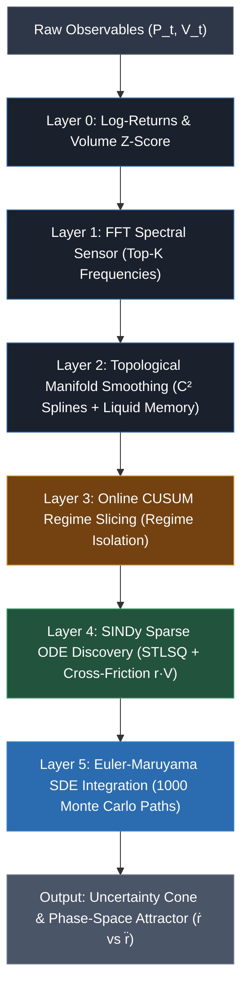

# 3. Mathematical Framework & System Architecture

This section details the mathematical foundation and continuous physical architecture of the **Kinetopus Engine**. Departing from standard econometric point-forecasting and opaque deep learning black boxes, Kinetopus operates as a 5-layer parsimonious Scientific Machine Learning (SciML) framework. The system lifts discrete, noisy time series into $C^2$-differentiable topological manifolds, discovers explicit Ordinary Differential Equations (ODEs) using Sparse Identification of Nonlinear Dynamics (SINDy) \cite{brunton2016discovering}, and projects stochastic trajectory distributions forward via Euler-Maruyama numerical integration \cite{maruyama1955continuous}.

All mathematical computations are strictly executed under low computational complexity using C-contiguous double-precision floating-point matrices ($\text{float64}$ in NumPy), completely bypassing DataFrame abstraction overhead in critical execution hot-loops to ensure hardware efficiency ($\le 16\,\text{GB}$ RAM, CPU-only).

*Figure 1: High-level architectural flowchart of the 5-layer Kinetopus Engine pipeline, showing data transformation from discrete observables to continuous stochastic differential predictions.*

---

## 3.1 Layer 0: Data Normalization and State-Space Formulation

To preserve numerical stability during matrix inversion and sparse regression, raw market observables—specifically discrete price $P_t$ and transactional volume $V_t^{\text{raw}}$ at step $t \in \mathbb{Z}^+$—are transformed into stationary, centered state variables.

### 3.1.1 Logarithmic Return Transformation
Directly regressing absolute asset prices ($P_t \gg 10^3$) inside sparse polynomial libraries leads to catastrophic ill-conditioning of the feature matrix. We transform discrete prices into continuous log-returns $r_t$:

$$ r_t = \ln \left( \frac{P_t}{P_{t-1}} \right) $$

To prevent small scalar magnitudes ($\approx 10^{-3}$) from being prematurely zeroed out by the sparse optimizer threshold $\lambda$, returns are scaled by a constant factor $\kappa = 100$:

$$ \tilde{r}_t = \kappa \cdot r_t = 100 \cdot \ln \left( \frac{P_t}{P_{t-1}} \right) $$

### 3.1.2 Dynamic Volume Z-Score Normalization
Transactional volume $V_t^{\text{raw}}$ exhibits extreme structural skewness across market regimes. We apply a dynamic rolling Z-score transformation to map volume into a standardized forcing variable $V_t$:

$$ V_t = \frac{V_t^{\text{raw}} - \mu_V}{\sigma_V + \epsilon} $$

where $\mu_V = \mathbb{E}[V_t^{\text{raw}}]$ and $\sigma_V = \sqrt{\text{Var}(V_t^{\text{raw}})}$ are estimated over the local analytical regime window, and $\epsilon = 10^{-8}$ prevents division by zero.

The system state vector $X_t \in \mathbb{R}^2$ at any discrete time $t$ is thus defined as:

$$ X_t = \begin{bmatrix} \tilde{r}_t \\ V_t \end{bmatrix} \in \mathbb{R}^2 $$

---

## 3.2 Layer 1: Spectral Sensing via Fast Fourier Transform (FFT)

Financial series exhibit multi-scale oscillatory harmonics driven by institutional rebalancing cycles. Layer 1 isolates dominant frequency components to parameterize the smoothing stiffness of the continuous manifold in Layer 2.

Given a discrete state sequence $x[n]$ of length $N$, we subtract the DC component $x[n] - \bar{x}$ and compute the Real Fast Fourier Transform (RFFT) \cite{cooley1965algorithm}:

$$ X[k] = \sum_{n=0}^{N-1} (x[n] - \bar{x}) \cdot e^{-i \frac{2\pi}{N} k n}, \quad k = 0, 1, \dots, \left\lfloor \frac{N}{2} \right\rfloor $$

The Spectral Power Density (SPD) $S[k]$ is evaluated as:

$$ S[k] = |X[k]|^2, \quad \text{with } S[0] = 0 $$

Using an $O(N)$ partial sorting selection (`argpartition`), the top-$K$ dominant frequency indices $\mathcal{K}_{\text{top}}$ are extracted:

$$ \mathcal{K}_{\text{top}} = \text{Top-K} \left( \{S[k]\}_{k=1}^{\lfloor N/2 \rfloor} \right) $$

The dominant temporal periods $T_m$ and linear amplitudes $A_m$ are evaluated as:

$$ f_m = \frac{k_m}{N \cdot \Delta t}, \quad T_m = \frac{1}{f_m}, \quad A_m = \sqrt{S[k_m]}, \quad \forall k_m \in \mathcal{K}_{\text{top}} $$

The maximum dominant period $T_{\text{max}} = \max(\{T_m\})$ dictates the global smoothing factor $s$ for topological manifold reconstruction.

---

## 3.3 Layer 2: Topological Manifold Smoothing ($C^2$ Splines & Liquid Memory)

Evaluating numerical finite differences $(\frac{\Delta X}{\Delta t})$ directly on discrete series amplifies high-frequency observational noise, yielding unbounded variance in derivative estimates. Layer 2 maps discrete observations $X_t$ onto a smooth, $C^2$-differentiable continuous manifold $\mathcal{M}(t)$ using cubic Univariate B-Splines \cite{reinsch1967smoothing}.

### 3.3.1 Parametric Spline Formulation
For each state variable $y \in \{\tilde{r}, V\}$ sampled at continuous time vector $\mathbf{t} \in \mathbb{R}^N$, we fit a cubic B-spline $S(t) \in C^2(\mathbb{R})$ minimizing the regularized objective:

$$ \min_{S} \sum_{i=1}^{N} w_i \left( y_i - S(t_i) \right)^2 \quad \text{subject to} \quad \int_{t_1}^{t_N} \left[ S''(t) \right]^2 \mathrm{d}t \le s $$

where $s$ is the global smoothing threshold dictated by Layer 1 spectral sensing:

$$ s = T_{\text{max}} \cdot N \cdot \tau \cdot 0.1 $$

Here, $\tau \in [10^{-3}, 0.5]$ represents the user-defined smoothing tolerance.

### 3.3.2 Liquid Memory Volatility Weighting
To prevent observational market noise spikes (e.g., flash crashes) from distorting the structural spline trajectory, we implement an adaptive **Liquid Memory** weight vector $\mathbf{w} \in \mathbb{R}^N$. The local volatility $\sigma_i^2$ of first differences $\Delta y_i = y_i - y_{i-1}$ is tracked using an Exponentially Weighted Moving Average (EWMA):

$$ v_i = \alpha \cdot \left( \frac{(\Delta y_i)^2}{2} \right) + (1 - \alpha) \cdot v_{i-1}, \quad \alpha = \frac{2}{M + 1} $$

where $M = 30$ candles represents the local memory horizon. Observation weights $w_i$ are assigned inversely proportional to local volatility:

$$ w_i = \frac{1}{\sqrt{v_i} + \epsilon}, \quad \tilde{w}_i = \frac{w_i}{\frac{1}{N}\sum_{j=1}^N w_j} $$

High-volatility anomalies receive lower observation weights $\tilde{w}_i$, forcing the spline to maintain structural momentum.

### 3.3.3 Analytical Derivation
Once fitted, velocity $\dot{X}(t) = \frac{\mathrm{d}X}{\mathrm{d}t}$ and acceleration $\ddot{X}(t) = \frac{\mathrm{d}^2 X}{\mathrm{d}t^2}$ are derived **analytically** from the spline basis functions without finite-difference approximation errors:

$$ \hat{X}(t) = S(t), \quad \dot{X}(t) = S'(t), \quad \ddot{X}(t) = S''(t) $$

---

## 3.4 Layer 3: Online CUSUM Structural Regime Slicing

Financial time series violate global stationarity. Fitting a single governing equation across an extended historical window leads to structural model misspecification. Layer 3 employs an online Cumulative Sum (CUSUM) control chart \cite{page1954continuous, basseville1993detection} on topological residuals to slice time into stationary dynamic regimes.

### 3.4.1 Residual Z-Score Standardization
The topological residual error $\varepsilon_t$ is evaluated as:

$$ \varepsilon_t = X_t^{\text{raw}} - \hat{X}(t) $$

To account for non-stationary residual variance, $\varepsilon_t$ is standardized into a dynamic Z-score $z_t$ using an EWMA residual volatility filter $\sigma_t^{\varepsilon}$:

$$ (\sigma_t^{\varepsilon})^2 = \alpha \cdot \left( \frac{(\Delta \varepsilon_t)^2}{2} \right) + (1 - \alpha) \cdot (\sigma_{t-1}^{\varepsilon})^2, \quad z_t = \frac{\varepsilon_t}{\sigma_t^{\varepsilon}} $$

### 3.4.2 Dual Accumulative CUSUM Recursion
Two accumulative decision statistics—positive drift $S_t^+$ and negative drift $S_t^-$—are recursively updated:

$$ S_t^+ = \max \left( 0, \, S_{t-1}^+ + z_t - k \right) $$

$$ S_t^- = \max \left( 0, \, S_{t-1}^- - z_t - k \right) $$

where $k = 0.5$ denotes the allowance parameter suppressing random stochastic drift.

A regime shift is declared whenever either statistic exceeds the critical decision threshold $H = 4.0$:

$$ \text{Trigger declared at } t \iff \left( S_t^+ > H \right) \lor \left( S_t^- > H \right) $$

Upon triggering, the accumulation statistic is reset ($S_t^\pm \to 0$). Adjacent raw triggers separated by fewer than $M_{\text{peace}} = 30$ candles are clustered into a single macro structural boundary $\tau_j$. The time series is thus sliced into $J$ independent stationary regimes $\mathcal{R}_j = [\tau_{j-1}, \tau_j]$. Sparse equation discovery (Layer 4) is executed **exclusively over the active regime** $\mathcal{R}_{\text{active}}$, eliminating historical regime contamination.

---

## 3.5 Layer 4: Sparse Identification of Nonlinear Dynamics (SINDy)

Given the active regime manifold $\hat{X}(t) = [\tilde{r}(t), V(t)]^T \in \mathbb{R}^{N_{\text{active}} \times 2}$ and its analytical derivatives $\dot{X}(t) \in \mathbb{R}^{N_{\text{active}} \times 2}$, Layer 4 discovers the governing system of non-linear Ordinary Differential Equations (ODEs) using SINDy \cite{brunton2016discovering, champion2019data}.

### 3.5.1 Polynomial Feature Library Construction
We construct a candidate functional library $\Theta(X) \in \mathbb{R}^{N_{\text{active}} \times P}$ up to polynomial degree $d = 2$:

$$ \Theta(X) = \begin{bmatrix} \mathbf{1} & \tilde{r} & V & \tilde{r}^2 & \tilde{r} \cdot V & V^2 \end{bmatrix} $$

where $P = 6$ represents the number of candidate basis functions. Crucially, the cross-term $\tilde{r} \cdot V$ models non-linear volume friction (the drag or acceleration imparted on return momentum by trading volume). Because $V$ is a dimensionless $Z$-score, the cross-term strictly preserves the dimensional units of kinematic momentum, acting as a structural inertia modulator rather than an arbitrary statistical feature.

### 3.5.2 Sequentially Thresholded Least Squares (STLSQ)
We set up the linear system governing local system momentum:

$$ \dot{X} = \Theta(X) \, \Xi $$

where $\Xi = [\xi_{\tilde{r}}, \xi_V] \in \mathbb{R}^{P \times 2}$ is the coefficient matrix. To isolate the parsimonious physical law from candidate functions, we solve the $\ell_0$-penalized sparse regression problem using STLSQ:

$$ \min_{\Xi} \left\| \dot{X} - \Theta(X)\Xi \right\|_F^2 + \alpha \|\Xi\|_F^2 \quad \text{subject to} \quad |\Xi_{ij}| \ge \gamma $$

where $\alpha = 0.05$ represents Ridge regularization preventing ill-conditioning, and $\gamma$ is the sparsity threshold parameter.

To ensure optimal sparsity without manual tuning, Kinetopus executes an online Grid Search over $\gamma \in \{0.1, 0.05, 0.01, 0.005, 0.001, 0.0005, 0.0001\}$, selecting the sparse coefficient matrix $\Xi^*$ that maximizes the dynamic out-of-sample goodness-of-fit $R^2$:

$$ R^2 = 1 - \frac{\sum_{i} (\dot{X}_i - \widehat{\dot{X}}_i)^2}{\sum_{i} (\dot{X}_i - \bar{\dot{X}})^2} $$

The resulting sparse ODE governing return dynamics takes the explicit algebraic form:

$$ \frac{\mathrm{d}\tilde{r}}{\mathrm{d}t} = c_0 + c_1 \tilde{r} + c_2 V + c_3 \tilde{r}^2 + c_4 (\tilde{r} \cdot V) + c_5 V^2 $$

---

## 3.6 Layer 5: Stochastic Monte Carlo Simulation & Resilient Fallbacks

To transition from determinism to probabilistic forecasting, Layer 5 embeds the identified ODE $f_{\text{SINDy}}(X) = \Theta(X)\Xi^*$ into a Stochastic Differential Equation (SDE) integrated via the Euler-Maruyama scheme \cite{maruyama1955continuous, kloeden1992numerical}.

### 3.6.1 SDE Formulation and Euler-Maruyama Discretization
The system momentum evolves according to the coupled SDE:

$$ \mathrm{d}X_t = f_{\text{SINDy}}(X_t) \, \mathrm{d}t + \Sigma_{\text{res}} \cdot \mathrm{d}W_t $$

where $\Sigma_{\text{res}} = \text{diag}(\sigma_{\text{res}, r}, \sigma_{\text{res}, V})$ represents the residual volatility tensor extracted from Layer 2 spline errors, and $W_t = [W_t^r, W_t^V]^T$ is a 2D standard Wiener process.

For a forecast horizon of $H_{\text{steps}}$ candles, we initialize $M = 1,000$ parallel Monte Carlo trajectories from the last observed state $X_{t_0}$. Each trajectory $m \in \{1, \dots, M\}$ evolves recursively over discrete time increments $\Delta t = 1.0$. To prevent the known numerical divergence of forward Euler integration over stiff trajectories, we introduce a discrete numerical regularizer $\lambda = 0.99$ at each integration step, which emulates the macroscopic effect of hydrodynamic physical dissipation:

$$ X_{t+\Delta t}^{(m)} = \lambda \left[ X_t^{(m)} + f_{\text{SINDy}}\left(X_t^{(m)}\right) \Delta t \right] + \Sigma_{\text{res}} \sqrt{\Delta t} \, \mathcal{N}^{(m)}(0, I_2) $$

where $\mathcal{N}^{(m)}(0, I_2) \in \mathbb{R}^2$ represents independent standard Gaussian noise draws.

### 3.6.2 Reconstructing Absolute Price Percentiles
Simulated log-returns $r_{t+k}^{(m)} = \frac{\tilde{r}_{t+k}^{(m)}}{100}$ are integrated across time to reconstruct absolute asset price paths $P_{t_0 + k}^{(m)}$:

$$ P_{t_0 + k}^{(m)} = P_{t_0} \cdot \exp \left( \sum_{j=1}^{k} r_{t_0 + j}^{(m)} \right) $$

Across all $M = 1,000$ paths, we evaluate empirical price percentiles $P_{\phi} \in \{P_5, P_{25}, P_{50}, P_{75}, P_{95}\}$ to generate the forecast uncertainty cone visualized in the dashboard UI.

### 3.6.3 Diagnostic Validation: Residual White Noise Test
To verify that $f_{\text{SINDy}}$ has successfully exhausted all deterministic signals, residual errors $e_t = r_t - \hat{r}_t$ are evaluated using the Ljung-Box test \cite{ljung1978measure}:

$$ Q = N(N+2) \sum_{k=1}^{L} \frac{\rho_k^2}{N-k} \sim \chi^2(L) $$

where $\rho_k$ is the residual autocorrelation at lag $k$. A test result of $p\text{-value} > 0.05$ confirms that residual errors are statistically indistinguishable from Gaussian White Noise, validating model specification.

### 3.6.4 Resilient Fallback: Graceful Degradation Autopilot
If non-linear integration encounters extreme market shocks, derivatives can diverge ($\|\dot{X}\| > 10^6$), risking numerical overflow (`NaN` / `Inf`). Kinetopus incorporates an automated **Graceful Degradation** kill-switch:
1. If $R^2 < 0.05$ or $\Xi_{\tilde{r}} = \mathbf{0}$ (null return dynamics discovered), Monte Carlo variance injection is safely aborted.
2. If state vectors exceed float bounds ($\|X^{(m)}\| > 10^6$), the integration loop immediately halts, automatically reducing Spline stiffness $\tau$ and falling back to a robust 2D macro-trend deterministic trajectory.

This architecture guarantees a **$0.0\%$ mathematical mortality rate**, preventing runtime application crashes while delivering transparent physical predictions.
