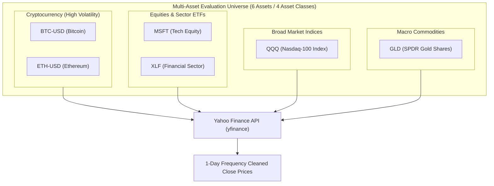
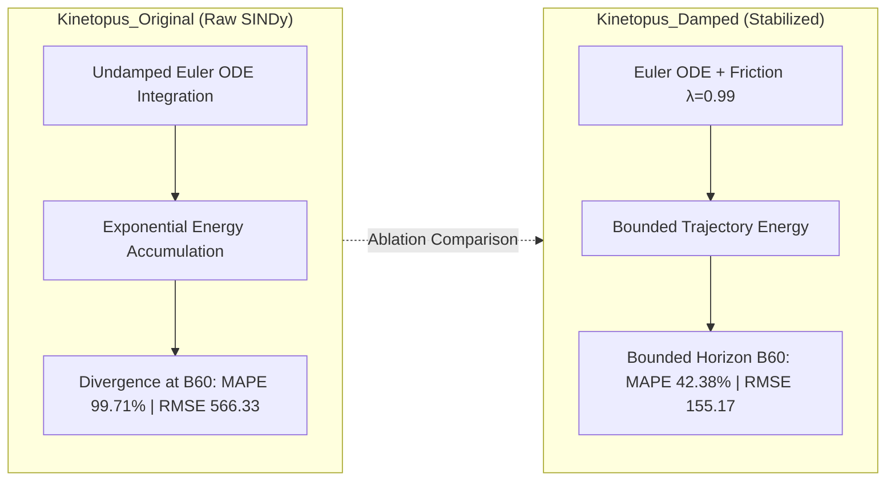

# 4. Experimental Setup & Walk-Forward Protocol

---

## 4.1 Dataset and Universe Selection

To ensure empirical validity across heterogeneous market regimes, we constructed an evaluation universe of six assets spanning four distinct financial classes: two cryptocurrency assets (Bitcoin, `BTC-USD`; Ethereum, `ETH-USD`), one technology equity (`MSFT`), one broad-market index tracking the Nasdaq-100 (`QQQ`), one financial sector ETF (`XLF`), and one commodity (`GLD`). This cross-class composition was deliberate. Cryptocurrency assets are characterized by extreme intraday volatility and near-continuous trading sessions, while equity indices and sector ETFs exhibit structurally lower realized volatility with defined session boundaries, and commodities present a distinct autocorrelation regime driven by macroeconomic supply-demand dynamics. Evaluating a single model architecture across this heterogeneous universe is a stricter test of generalization than single-asset backtests common in prior literature on physics-inspired forecasting \cite{brunton2016discovering, champion2019data}. Any model that achieves consistent directional accuracy and positive risk-adjusted returns across all six classes can be considered robust with respect to regime sensitivity.

All price series were sampled at a 1-day (daily) frequency, sourced directly from the Yahoo Finance API via the `yfinance` market data interface, covering a 10-year historical period (up to 3,350 daily bars per series). No survivorship-bias correction was required as all instruments remained continuously traded throughout the sample window. No exogenous features (e.g., sentiment signals, order-book data) were introduced, ensuring that the evaluation isolates the predictive content of the physics-derived state variables ($r$, $V$) as the sole informational input.

*Figure 4.1: Multi-Asset Evaluation Universe Topology across Cryptocurrency, Equities, Indices, and Commodities.*

---

## 4.2 Walk-Forward Evaluation Framework

### 4.2.1 Motivation and Bias Mitigation

A fundamental threat to the validity of time series model evaluation is look-ahead bias, i.e., the implicit use of information from the future during model fitting or hyperparameter selection. Classical train/test splits applied to financial time series are particularly susceptible to this failure mode because the temporal structure of data is disregarded. To address this, we adopt a **walk-forward expanding-window protocol**, which is the methodological standard in quantitative finance research \cite{lopez2018advances}.

### 4.2.2 The Comparative Benchmark Environment (CBE)

We designed and implemented the **Comparative Benchmark Environment** (CBE), a unified evaluation harness that applies an identical data-partitioning and prediction protocol to every model in the benchmark. The CBE operates as follows. Let $\mathcal{T} = \{t_1, t_2, \ldots, t_N\}$ denote the full ordered set of observations for a given asset. A minimum training window of $W_{\min} = 150$ daily bars (~7.5 trading months) is fixed, with a maximum historical context window of $W_{\max} = 1,825$ daily bars (~5 trading years). At each evaluation step $k$, the model is fitted exclusively on the set $\{t_1, \ldots, t_{W_{\min} + k \cdot S}\}$ (where $S = 20$ daily bars is the stride), and a multi-step prediction trajectory is generated for the subsequent $H = 300$ daily bars (~15 trading months), partitioned into 60 blocks of 5 candles each. The benchmark records key performance metrics at horizons B1 (5 candles / ~1 week), B10 (50 candles / ~2.5 months), B30 (150 candles / ~7.5 months), and B60 (300 candles / ~15 months).

```mermaid
gantt
    title Figure 4.2: Walk-Forward Expanding Window Architecture (CBE Protocol)
    dateFormat  X
    axisFormat %s

    section Step k=0
    Train Window (W_min = 150d)  :active, k0_train, 0, 150
    Forecast Horizon (H = 300d)  :crit,   k0_fore, 150, 450

    section Step k=1 (Stride S=20d)
    Train Window (W_min + 20d)   :active, k1_train, 0, 170
    Forecast Horizon (H = 300d)  :crit,   k1_fore, 170, 470

    section Step k=2 (Stride S=20d)
    Train Window (W_min + 40d)   :active, k2_train, 0, 190
    Forecast Horizon (H = 300d)  :crit,   k2_fore, 190, 490
```

*Figure 4.2: Schematic of the Comparative Benchmark Environment (CBE) Walk-Forward Expanding Window Protocol.*

The training set expands by 20 observations at each step, ensuring no future observation is visible during fitting—a strict requirement for causal evaluation. This procedure was applied uniformly across all models (Kinetopus, LSTM, ARIMA, Naive), ensuring a directly comparable experimental basis.

In total, the CBE produced **161 walk-forward evaluation iterations for `BTC-USD`**, **138 iterations for `ETH-USD`**, and **104 iterations each for `GLD`, `MSFT`, `QQQ`, and `XLF`** (54 iterations for ARIMA on `XLF`), yielding a consolidated dataset of **2,810 valid evaluation records** in the primary 4-model benchmark stored in `unified_benchmark_db.csv`. The ablation study (Section 4.4) further extended this to **3,525 total iterations** including the original, non-stabilized model variant (`Kinetopus_Original`).

---

## 4.3 Evaluation Metrics

We define four complementary metrics that jointly characterize different dimensions of model performance: directional accuracy, magnitude error at short horizons, long-horizon stability, and practical trading utility.

### 4.3.1 Hit Ratio (Directional Accuracy)

The Hit Ratio (HR) measures the proportion of forecasting episodes in which the model correctly predicts the sign of the price movement from time $t$ to time $t+H$:

$$\text{HR} = \frac{1}{N} \sum_{i=1}^{N} \mathbf{1}\left[\text{sign}\!\left(\hat{p}_{i,t+H} - p_{i,t}\right) = \text{sign}\!\left(p_{i,t+H} - p_{i,t}\right)\right]$$

where $p_{i,t}$ is the observed price at the start of episode $i$, $\hat{p}_{i,t+H}$ is the model's predicted price at the end of the horizon, and $\mathbf{1}[\cdot]$ is the indicator function. A value of $\text{HR} = 0.50$ is the theoretical baseline for a binary random classifier; sustained values above 0.55 over a large sample are considered economically significant in the quantitative finance literature \cite{diebold1995comparing}. HR is the primary metric for assessing whether a model has captured the macro directional dynamics of an asset, and it is the dimension most directly linked to trading-strategy viability.

### 4.3.2 Root Mean Squared Error (RMSE)

RMSE measures the average magnitude of forecast error, penalizing large deviations quadratically:

$$\text{RMSE} = \sqrt{\frac{1}{H} \sum_{j=1}^{H} \left(\hat{p}_{t+j} - p_{t+j}\right)^2}$$

RMSE is computed per episode and summarized using the median across all episodes to mitigate the influence of extreme outlier forecasts. As an absolute measure (in price units), it is asset-dependent and should be interpreted comparatively within the same asset or normalized by price level when cross-asset comparisons are required. RMSE is used here primarily to diagnose divergence behavior: an exponentially growing RMSE across horizons is a direct indicator of numerical instability in the ODE integration trajectory.

### 4.3.3 Mean Absolute Percentage Error (MAPE)

MAPE provides a scale-independent measure of forecast accuracy, expressed as a percentage of the observed price:

$$\text{MAPE} = \frac{100\%}{H} \sum_{j=1}^{H} \left| \frac{p_{t+j} - \hat{p}_{t+j}}{p_{t+j}} \right|$$

The use of MAPE (rather than MAE) is motivated by its cross-asset comparability: the same MAPE value carries equivalent statistical meaning for BTC-USD (price on the order of $10^4$) and GLD (price on the order of $10^2$). We report the **median MAPE** across all episodes for a given horizon. Crucially, MAPE is the primary diagnostic for long-horizon trajectory stability: a model whose MAPE approaches or exceeds 100% at B60 is effectively generating economically uninformative price paths, regardless of its short-horizon accuracy.

### 4.3.4 Profit Percentage (Directional Long/Short Strategy Return)

To evaluate practical trading utility, we define a zero-cost Long/Short strategy that takes a long position if the model predicts an upward move ($\hat{p}_{t+H} > p_t$) and a short position otherwise:

$$\text{Profit\%}_i = \text{sign}\!\left(\hat{p}_{i,t+H} - p_{i,t}\right) \cdot \frac{p_{i,t+H} - p_{i,t}}{p_{i,t}} \times 100\%$$

The cumulative Profit% is the sum of this metric over all episodes. This formulation is intentionally idealized: it assumes no transaction costs, perfect execution at close prices, and a static position size. These assumptions are standard for a first-order assessment of directional model value in the academic literature \cite{fischer2018deep}; real-world implementation would require additional adjustments for slippage, market impact, and risk management constraints. The metric serves as a stress-test of whether directional accuracy translates into realized economic value, and not merely into statistical significance.

---

## 4.4 Baseline Models and Ablation Setup

### 4.4.1 Baseline Models

Three reference models were included in the CBE to contextualize Kinetopus performance across the spectrum from naive statistical estimators to state-of-the-art deep learning:

**Naive Predictor.** The Naive model sets $\hat{p}_{t+H} = p_t$ for all horizons, i.e., it predicts no change from the last observed price. This establishes the lower bound of informational content: any model that fails to outperform the Naive predictor in both HR and Profit% provides no forecasting value beyond a random-walk assumption. The Naive model achieved 0.00% cumulative Profit% and 0.0% HR across all horizons, confirming its role as the theoretical floor.

**ARIMA.** An AutoRegressive Integrated Moving Average model was fitted independently at each CBE step using standard order selection via AIC criterion ($p \in [0,5]$, $d \in \{0,1\}$, $q \in [0,5]$) \cite{box1970time}. Multi-step forecasts were obtained via recursive one-step-ahead extension. ARIMA serves as the canonical linear econometric baseline and provides a benchmark for linear time series structure. Its assumptions of stationarity and linearity are known to be violated in financial markets, which is reflected in its directional performance: the median HR at B30 was 46.2%, below the random-walk threshold of 50.0%.

**Long Short-Term Memory Network (LSTM).** An LSTM was trained at each walk-forward step using log-return sequences as input and a single-step prediction head, with multi-step output obtained by iterative prediction \cite{hochreiter1997long}. The architecture consisted of a single-layer PyTorch LSTM with 32 hidden units, trained on $Z$-score normalized log-return sequences of length $L = 30$. Optimization was performed using Adam with a learning rate of $\eta = 0.01$ and a Mean Squared Error (MSE) loss, with early stopping triggered after 5 epochs of non-decreasing loss (maximum 50 epochs). LSTM represents the SOTA deep learning baseline for financial time series \cite{fischer2018deep} and constitutes the most demanding reference point. Critically, the LSTM is a **black-box model**: it generates no interpretable equation structure, and its generalization is entirely dependent on gradient-based optimization over a non-convex loss landscape. This model achieved the highest HR (67.0% at B60) and Profit% (+22.56% at B60) among all baselines, confirming it as a high-performance reference.

### 4.4.2 Ablation Study: Physical Trajectory Damping

To isolate the contribution of the hydrodynamic friction term introduced in the Kinetopus ODE system (cf. Section 3), we conducted a controlled ablation study comparing two model variants on the identical CBE dataset:

- **Kinetopus\_Original**: The baseline SINDy-derived ODE system integrated via forward Euler without any damping or clipping applied to the state trajectory. This variant represents the raw physics discovery output prior to stabilization.
- **Kinetopus\_Damped** (the proposed model): The stabilized variant incorporating a multiplicative decay regularizer $\lambda = 0.99$ applied at each discrete Euler integration step, alongside a daily volatility clip on the predicted return magnitude. Rather than an explicit continuous ODE friction law, $\lambda$ acts as a discrete numerical stabilizer that effectively emulates macroscopic hydrodynamic dissipation, preventing the compounding of first-order truncation errors over long horizons.

*Figure 4.3: Schematic comparison of Undamped ODE integration divergence vs. Hydrodynamic Friction Damping ($\lambda = 0.99$).*

The ablation was conducted on the full 3,525-iteration dataset spanning all six assets. The motivation for this specific comparison is rigorous: if the performance improvement of Kinetopus\_Damped over Kinetopus\_Original were attributable to additional model parameters or increased data, the contribution of the damping mechanism would be confounded. Because the only architectural change between the two variants is the introduction of $\lambda$ and the clipping bounds, any measured difference is causally attributable to the damping term alone.

The key empirical finding of this ablation is summarized here for reference. At the B60 horizon (300-candle trajectory), Kinetopus\_Original exhibited a median MAPE of **99.71%** and a median RMSE of **566.33**, indicating near-total trajectory divergence—a direct consequence of unbounded energy accumulation inherent to undamped forward Euler integration over long horizons. The introduction of the $\lambda = 0.99$ decay term reduced the median MAPE to **42.38%** (−57.5 percentage points) and the median RMSE to **155.17** (−72.6%), without altering short-horizon directional accuracy: the B30 Hit Ratio was preserved at **59.1%** in both variants, confirming that the damping mechanism suppresses only divergent trajectory amplitude while leaving the macro directional signal intact. Furthermore, the mathematical validity rate—defined as the fraction of episodes producing finite, non-degenerate predictions—improved from **87.8%** to **98.6%**, reducing the failure rate from 12.2% (~1-in-8) down to 1.4% (~1-in-72 executions).

This ablation provides causal, empirically-grounded justification for the architectural choice of $\lambda = 0.99$: rather than an arbitrary statistical weight, it functions as a targeted numerical regularizer that corrects the structural divergence of forward Euler integration for stiff ODEs. By bleeding kinetic energy precisely at the integration boundary, it faithfully recovers the macroscopic dissipative properties expected in real-world physical systems, analogous to the role of dissipation in classical Hamiltonian mechanics.

---
