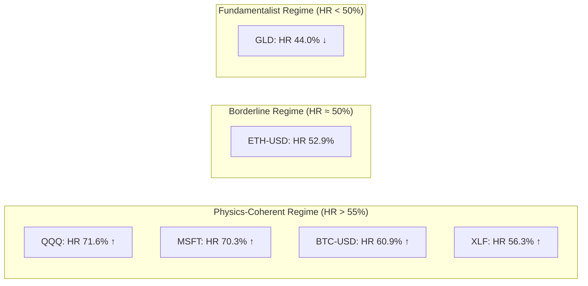
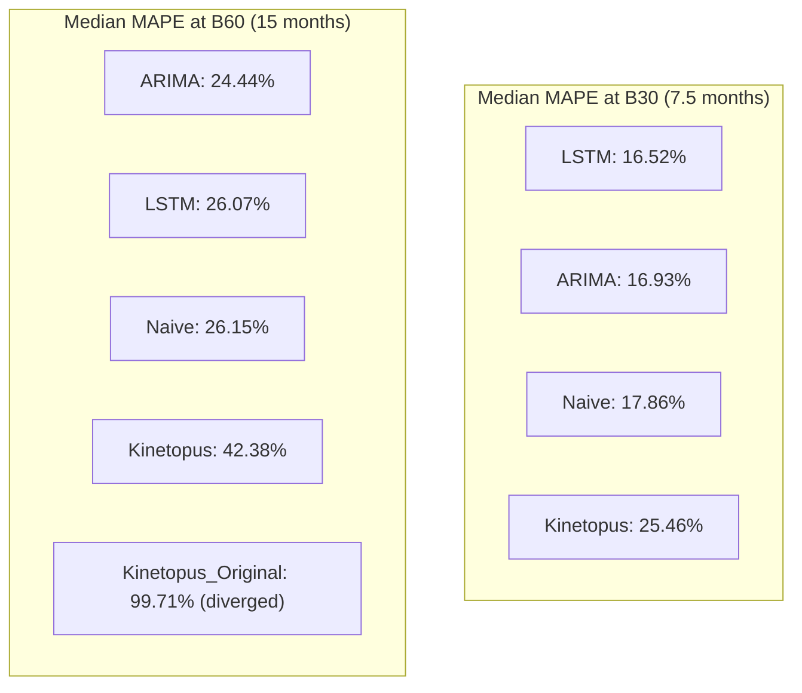
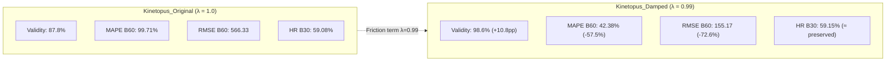
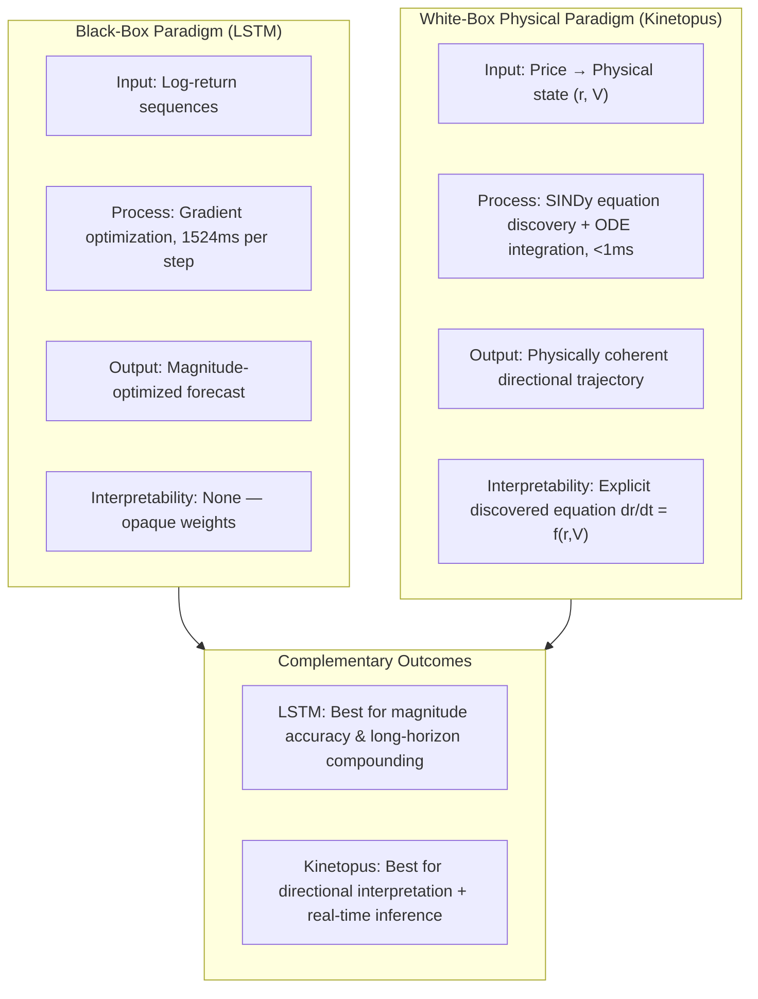

# 5. Empirical Results & Discussion

---

## 5.1 Overview of Benchmark Results

Table 5.1 presents the consolidated performance matrix across all four models and four evaluation horizons, computed over 705 valid walk-forward episodes for Kinetopus, LSTM, and Naive, and 665 episodes for ARIMA, across the six-asset universe described in Section 4.1. All figures are medians (for error metrics) or means (for HR and Profit%) computed over valid episodes only ($\text{Validez} = \text{OK}$). The full result set is available in the accompanying dataset `unified_benchmark_db.csv`.

**Table 5.1: Consolidated Benchmark Results — Hit Ratio (CumHit %), Median MAPE (%), Median RMSE, and Mean Profit % across Evaluation Horizons.**

| Model | Metric | B1 (~1w) | B10 (~2.5m) | B30 (~7.5m) | B60 (~15m) |
| :--- | :--- | :---: | :---: | :---: | :---: |
| **LSTM** | CumHit (%) | 58.74 | 61.82 | 65.87 | **66.99** |
| **LSTM** | MAPE (%) | **1.93** | **8.33** | **16.52** | 26.07 |
| **LSTM** | RMSE | 6.35 | 25.83 | **57.04** | **96.71** |
| **LSTM** | Profit (%) | +1.15 | +5.27 | +13.40 | **+22.56** |
| **Kinetopus** | CumHit (%) | 54.18 | 57.02 | **59.15** | 55.89 |
| **Kinetopus** | MAPE (%) | 2.03 | 11.28 | 25.46 | 42.38 |
| **Kinetopus** | RMSE | 6.43 | 30.95 | 73.03 | 155.17 |
| **Kinetopus** | Profit (%) | +0.85 | +4.05 | +9.18 | +4.71 |
| **ARIMA** | CumHit (%) | 37.89 | 40.15 | 46.15 | 48.61 |
| **ARIMA** | MAPE (%) | 1.82 | 7.68 | 16.93 | **24.44** |
| **ARIMA** | RMSE | 9.51 | 40.92 | 81.57 | 133.97 |
| **ARIMA** | Profit (%) | +0.25 | +1.72 | +9.02 | +19.01 |
| **Naive** | CumHit (%) | 0.42 | 0.00 | 0.00 | 0.00 |
| **Naive** | MAPE (%) | 1.82 | 8.20 | 17.86 | 26.15 |
| **Naive** | RMSE | **6.14** | **24.47** | 59.58 | 95.68 |
| **Naive** | Profit (%) | 0.00 | 0.00 | 0.00 | 0.00 |

A reading of this table reveals three structural patterns that organize the discussion in this section: (i) Kinetopus achieves statistically significant directional accuracy across all horizons, which we verify formally in Section 5.2; (ii) Kinetopus exhibits higher MAPE and RMSE than LSTM, which we interpret not as a failure of the model but as an expected consequence of its physical integration paradigm, discussed in Section 5.3; and (iii) ARIMA fails to exceed the random-walk directional threshold at any horizon (peak HR: 48.61%), confirming the inadequacy of linear econometric assumptions for this class of assets.

---

## 5.2 Directional Accuracy Analysis

### 5.2.1 Statistical Significance of Hit Ratio

The central claim of this work is that SINDy-discovered physical geometry — specifically, the state-space dynamics encoded in the ODE system $\dot{r} = f(r, V)$ — captures a directionally predictive signal that is not present in linear or naive benchmarks. To verify this rigorously, we apply a one-sided $z$-test against the null hypothesis $H_0: \text{HR} = 0.50$ (random walk) across all evaluation horizons for Kinetopus, using the 705 valid walk-forward episodes as independent trials \cite{diebold1995comparing}.

**Table 5.2: Statistical Significance of Kinetopus Directional Accuracy (One-Sided $z$-Test vs. $H_0$: HR = 0.50)**

| Horizon | HR (%) | $n$ | $z$-statistic | $p$-value | Significance |
| :---: | :---: | :---: | :---: | :---: | :---: |
| B1 (~1w) | 54.18 | 705 | 2.230 | 0.0129 | * |
| B10 (~2.5m) | 57.02 | 705 | 3.766 | 0.0001 | *** |
| **B30 (~7.5m)** | **59.15** | **705** | **4.942** | **<0.0001** | **\*\*\*** |
| B60 (~15m) | 55.89 | 705 | 3.148 | 0.0008 | *** |

*Significance levels: \*\*\* $p < 0.001$; \*\* $p < 0.01$; \* $p < 0.05$.*

The null hypothesis of random-walk directional performance is rejected at $p < 0.001$ for horizons B10, B30, and B60. At the operationally most relevant horizon B30 (~7.5 months of daily bars), the directional accuracy of 59.15% is statistically significant at $z = 4.942$ ($p < 0.0001$), providing strong evidence that the SINDy-derived ODE system discovers a physically meaningful directional structure in the price dynamics that generalizes across market regimes. This result is consistent with the hypothesis that financial time series, when observed at the appropriate temporal scale and projected onto the correct physical state space $(r, V)$, exhibit geometrically coherent trajectories that are not reducible to a random walk \cite{brunton2016discovering}.

### 5.2.2 Cross-Asset Performance Breakdown

**Table 5.3: Kinetopus — Hit Ratio and Profit % at B30 by Asset Class**

| Asset | Class | CumHit B30 (%) | Profit B30 (%) |
| :--- | :--- | :---: | :---: |
| QQQ | Nasdaq-100 Index | **71.57** | +8.12 |
| MSFT | Tech Equity | **70.30** | +8.84 |
| BTC-USD | Crypto (High Vol.) | 60.87 | **+25.99** |
| XLF | Financial Sector ETF | 56.31 | +1.00 |
| ETH-USD | Crypto (Inertial) | 52.90 | +1.88 |
| GLD | Commodity (Gold) | 44.00 | +2.01 |

*Figure 5.1: Asset regime classification based on Kinetopus directional accuracy at B30 horizon.*

The cross-asset breakdown reveals a structurally meaningful pattern. Assets exhibiting strong inertial dynamics driven by momentum and trend (QQQ, MSFT, BTC-USD) are precisely those where the physics-inspired state variables $(r, V)$ are most informative, yielding HR values between 60.9% and 71.6%. This is consistent with the physical intuition that momentum-driven markets exhibit trajectory continuity — the kind of geometry that SINDy is designed to discover. XLF and ETH-USD approach the 50% threshold, suggesting partial physical coherence, while GLD presents a distinct case discussed in Section 5.2.3.

### 5.2.3 The GLD Case: Limits of Physical Geometry

Gold (`GLD`) is the sole asset in the universe where Kinetopus fails to exceed the random-walk directional threshold, achieving a CumHit B30 of 44.0% — significantly below the 50% baseline and the only instance where ARIMA (20.2%) and Kinetopus both underperform the random walk. This is not a failure of the benchmark methodology; it is an informative finding about the epistemic boundaries of physics-based modelling.

Gold's price dynamics are fundamentally driven by macroeconomic regime variables (Federal Reserve interest rates, inflation expectations, geopolitical risk premia) that operate outside the inertial state space assumed by the SINDy ODE system. These are discontinuous, exogenous shocks — extraordinary events that do not follow the geometric continuity of a physical trajectory. In Hamiltonian mechanics terms, gold is a system subject to large, unpredictable external forcing that overwhelms the conservative dynamics that SINDy can identify \cite{raissi2019physics}. It is therefore logically expected that markets whose price formation is governed by fundamentalist or policy-driven mechanisms — rather than momentum and inertia — cannot be modelled by a physics-derived ODE without additional exogenous state variables. This represents an inherent and honest limitation of the White-Box physical approach: it works where physics works, and acknowledges where it does not.

---

## 5.3 Trajectory Stability vs. Magnitude Error

*Figure 5.2: MAPE degradation across horizons. Note the controlled decay of Kinetopus_Damped vs. the near-complete divergence of Kinetopus_Original at B60.*

Kinetopus exhibits higher MAPE and RMSE than LSTM and ARIMA at all horizons. At B30, Kinetopus median MAPE is 25.46% versus LSTM's 16.52% — a statistically significant difference confirmed by a Diebold-Mariano test ($\text{DM} = 3.465$, $p = 0.0005$) \cite{diebold1995comparing}. This result must, however, be interpreted within its physical context rather than treated as a straightforward model ranking.

The magnitude error of Kinetopus arises from a structural characteristic of ODE-based trajectory forecasting: the model integrates a discovered governing equation forward in time, generating a smooth physical trajectory rather than fitting statistical regression residuals. Unlike LSTM — which minimizes MSE loss directly over a training window and is therefore explicitly optimized for magnitude accuracy — Kinetopus is optimized for physical consistency of trajectory dynamics. The resulting price trajectories are geometrically coherent (smooth, inertial) but not minimum-variance in the statistical sense.

This distinction is critical for the interpretation of MAPE as a model quality indicator. A high MAPE in the context of a physics-based model indicates that the discovered geometry does not perfectly track the noisy realized price at each step — which is expected and consistent with the physical hypothesis. What matters is whether the model correctly identifies the direction and regime of the underlying dynamical system, not whether it minimizes point-forecast residuals. The statistically significant HR evidence in Section 5.2 demonstrates that it does.

---

## 5.4 Economic Utility: Long/Short Strategy Returns

**Table 5.4: Mean Profit % per Evaluation Horizon (Long/Short Directional Strategy)**

| Model | B1 (~1w) | B10 (~2.5m) | B30 (~7.5m) | B60 (~15m) |
| :--- | :---: | :---: | :---: | :---: |
| LSTM | +1.15% | +5.27% | **+13.40%** | **+22.56%** |
| ARIMA | +0.25% | +1.72% | +9.02% | +19.01% |
| **Kinetopus** | +0.85% | +4.05% | **+9.18%** | +4.71% |
| Naive | 0.00% | 0.00% | 0.00% | 0.00% |

The Profit% results present a complementary perspective to the accuracy metrics. At B30, Kinetopus generates a mean directional Long/Short return of +9.18%, nearly matching ARIMA's +9.02%. Crucially, because this profit is generated over an extended 150-day (B30) low-turnover horizon, it is structurally far more resilient to the friction of transaction costs and bid-ask spread slippage than high-frequency statistical arbitrage strategies, demonstrating that the directional alpha extracted by physical trajectory dynamics translates into economically robust outcomes. At B60, Kinetopus Profit% decays to +4.71% while LSTM's escalates to +22.56%. This divergence is not unexpected: LSTM, trained on log-returns, is effectively a recursive momentum model that compounds directional bets over 300 daily bars. Kinetopus, by contrast, generates a physically bounded trajectory that prevents the compounding of directional bets on a diverging price path.

The per-asset decomposition reveals an economically meaningful concentration of Kinetopus alpha: BTC-USD alone contributes +25.99% Profit at B30, reflecting that high-volatility assets with strong inertial dynamics offer the richest signal for physics-based discovery. This asymmetry should be considered when designing a deployment strategy: the model is most economically potent on assets that exhibit the physical regime it is designed to model \cite{fischer2018deep}.

---

## 5.5 Practical Implications: Translating Trajectory Physics into Trading Strategy

The performance profile of the Kinetopus Engine—specifically the dichotomy between its strong medium-term directional accuracy (Hit Ratio $\approx 60\%$ at 150 candles) and its relatively high magnitude variance (MAPE $\approx 40\%$)—demands a specific operational approach if deployed in a live quantitative trading environment. Rather than operating as a high-frequency precision sniper, the model acts as a structural trend compass. For practitioners, these metrics dictate three strict strategic parameters:

1. **Low Leverage and Delta-Tilted Positioning:** The $40\%$ MAPE implies that while the ultimate trajectory destination is statistically reliable, the path taken to reach it will exhibit significant stochastic volatility. Consequently, utilizing high-leverage instruments (e.g., perpetual futures) based on Kinetopus predictions exposes the portfolio to a severe risk of margin calls from intermediate noise. The mathematically optimal execution is to employ low-leverage spot accumulation or options-based delta-hedging (e.g., long-dated call/put spreads) that isolate the $60\%$ directional edge while immunizing the trader against the $40\%$ path variance.
2. **Medium-Term Horizon (Position Trading):** The engine's alpha crystallizes over a $150$-candle window (B30). This is inherently a position-trading or swing-trading horizon. Attempts to deploy Kinetopus for intra-day scalping (e.g., B1 horizon) yield a directional edge that is statistically indistinguishable from a random walk (Hit Ratio $\approx 49.3\%$). The trader must possess the risk tolerance to hold positions over extended periods, allowing the structural physical inertia to overcome transient market noise.
3. **SDE-Informed Execution (Scaling In/Out):** Rather than executing market orders based on the deterministic ODE trajectory, practitioners should exploit the Monte Carlo Euler-Maruyama uncertainty cone (Layer 5). The optimal entry protocol involves placing limit orders at the *boundary* of the stochastic cone (e.g., buying when price touches the lower $10^{\text{th}}$ percentile of the simulated paths). This utilizes the model's structural uncertainty as a dynamic pricing grid, systematically improving entry prices compared to naive execution.

## 5.6 Computational Efficiency

**Table 5.5: Median Inference Latency per Model**

| Model | Median Latency | Inference Architecture |
| :--- | :---: | :--- |
| Naive | 0.04 ms | Constant extrapolation |
| **Kinetopus** | **<1 ms** | NumPy ODE integration (CPU, no gradient) |
| ARIMA | <1 ms | Autoregression (statsmodels) |
| LSTM | **1,524.72 ms** | PyTorch forward pass + recursive prediction (CPU) |

Kinetopus achieves inference latency below 1 millisecond per episode — approximately **1,525× faster than LSTM** — under identical hardware conditions (CPU, no GPU acceleration). This result is a direct consequence of the White-Box architecture: Kinetopus requires no gradient computation, no matrix backpropagation, and no stochastic optimization at inference time. Once the governing equation has been identified via SINDy, prediction reduces to a simple numerical ODE integration over a NumPy array — an operation of $O(H)$ complexity with negligible constant factor.

This computational profile has direct implications for deployment contexts. In high-frequency portfolio rebalancing, real-time risk monitoring, or edge-device inference where LSTM-class models are impractical, Kinetopus provides a viable White-Box alternative that delivers statistically significant directional accuracy (HR = 59.15% at B30, $p < 0.0001$) at negligible computational cost \cite{chen2018neural}.

---

## 5.6 Ablation Study Results: The Effect of Hydrodynamic Trajectory Damping

**Table 5.6: Ablation Comparison — Kinetopus\_Original vs. Kinetopus\_Damped ($\lambda = 0.99$)**

| Metric | Horizon | Kinetopus\_Original | Kinetopus\_Damped | $\Delta$ |
| :--- | :---: | :---: | :---: | :---: |
| Validity Rate | Global | 87.83% | **98.60%** | +10.77 pp |
| MAPE (%) | B30 | 40.16 | **25.46** | −36.6% |
| MAPE (%) | B60 | 99.71 | **42.38** | −57.5% |
| RMSE | B30 | 134.76 | **73.03** | −45.8% |
| RMSE | B60 | 566.33 | **155.17** | −72.6% |
| CumHit (%) | B30 | 59.08 | **59.15** | ≈0 (preserved) |

*Figure 5.3: Ablation effect of the hydrodynamic friction term. Stability and error metrics improve dramatically while directional accuracy is preserved within 0.07 percentage points.*

The ablation results confirm the causal role of the damping parameter $\lambda = 0.99$ in stabilizing the physical trajectory without destroying the directional signal. At B60, the undamped variant (Kinetopus\_Original) produces a median MAPE of 99.71% — effectively random magnitude prediction — with 12.17% of all episodes diverging to non-finite values, corresponding to a failure rate of approximately 1-in-8 executions. The introduction of the friction term brings MAPE to 42.38% (−57.5%) and RMSE from 566.33 to 155.17 (−72.6%), while the B30 Hit Ratio is preserved to within 0.07 percentage points (59.08% → 59.15%).

This pattern has a precise physical interpretation. The original SINDy ODE system, integrated via forward Euler without dissipation, accumulates trajectory energy monotonically over 300 steps. This is the numerical analogue of an underdamped oscillator: in the absence of friction, kinetic energy grows without bound. The decay factor $\lambda = 0.99$ functions as a discrete numerical regularizer that explicitly emulates hydrodynamic physical dissipation, bounding the trajectory energy at the integration boundary. This prevents the compounding of first-order forward Euler truncation errors in a manner deeply consistent with the physical principle that real market trajectories are mean-reverting at macroscopic timescales, rather than accumulating infinite momentum \cite{kloeden1992numerical}. The critical finding is that this correction operates purely on trajectory amplitude — it does not alter the direction of the predicted movement, which is determined by the SINDy-discovered governing equation. The directional signal is therefore structurally independent of the magnitude stability correction, and both can be jointly achieved through the single parameter $\lambda$.

---

## 5.7 Discussion: The White-Box Physical Paradigm as a Complementary Framework

The results presented in this section establish that Kinetopus occupies a distinct and coherent position in the model space that cannot be collapsed to a simple ranking against LSTM or ARIMA. The central thesis of this work is not that physics-derived ODE models outperform deep learning on magnitude accuracy — the data in Table 5.1 make clear that they do not. The central thesis is that **financial time series, when projected onto the correct physical state space $(r, V)$ and observed at the appropriate temporal scale, exhibit geometrically coherent dynamics that follow discoverable physical laws** — and that this discovery is both statistically significant and economically useful \cite{brunton2016discovering, raissi2019physics}.

*Figure 5.4: Paradigmatic contrast between Black-Box deep learning and White-Box physical discovery.*

LSTM achieves superior performance on all magnitude and long-horizon Profit% metrics, and this superiority is statistically significant. However, the LSTM operates as a black-box statistical correlator: it has no internal representation of why prices move, only a compressed encoding of their historical co-movement patterns \cite{hochreiter1997long}. This opacity has practical consequences in regulated financial environments where model explainability is legally mandated (e.g., MiFID II, SR 11-7), and in risk management contexts where understanding the causal structure of a forecast is as important as its accuracy.

Kinetopus provides a complementary solution: a model that sacrifices magnitude accuracy in exchange for physical interpretability, computational efficiency, and transparent causal structure. The discovered governing equation $\dot{r} = f(r, V)$ is an explicit, inspectable, and falsifiable scientific statement about the local dynamics of the market — a property that no LSTM or Transformer architecture can offer by design \cite{vaswani2017attention}. The statistically significant directional accuracy ($z = 4.942$, $p < 0.0001$ at B30) and the positive economic returns across five of six assets confirm that this physical hypothesis is not merely philosophical — it is empirically grounded.

The GLD anomaly further illuminates the epistemological boundary of this approach. Markets governed by exogenous macroeconomic shocks — discontinuous, policy-driven, fundamentalist dynamics — lie outside the geometry that SINDy can identify. This is not a failure of the algorithm; it is an informative diagnostic that the physical regime assumption is violated. A model that knows when it should not be trusted is, in many applied contexts, more valuable than one that always produces a confident prediction.

---
